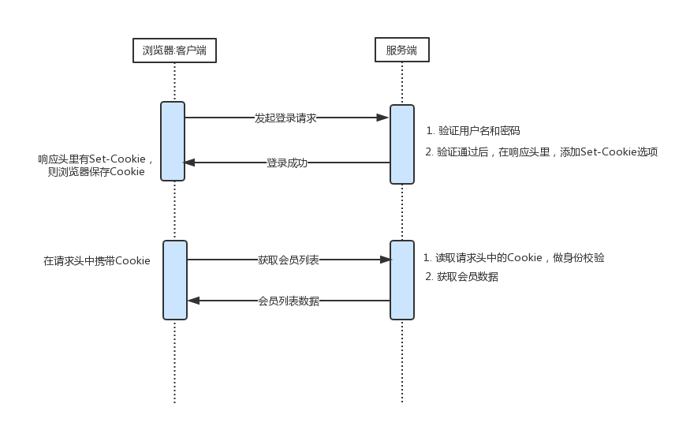
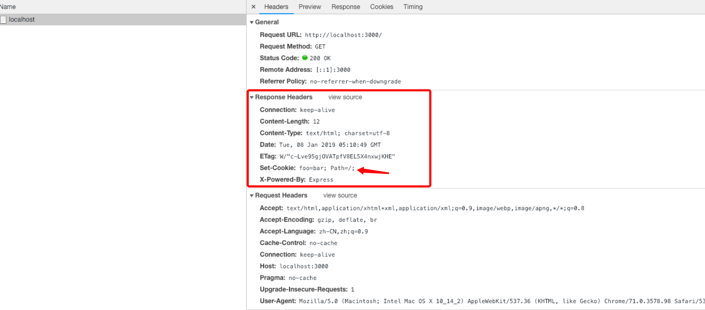
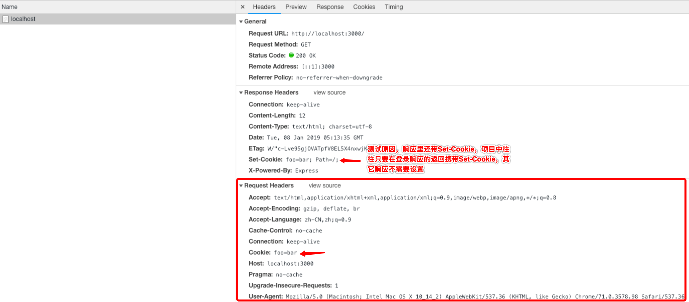
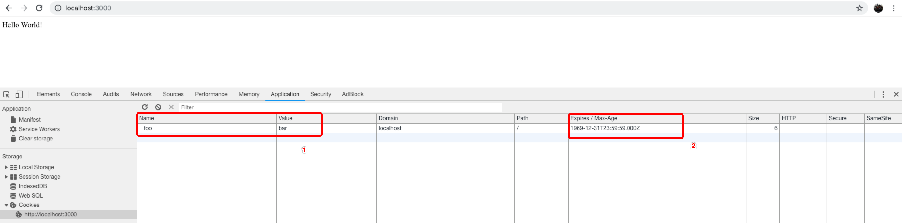
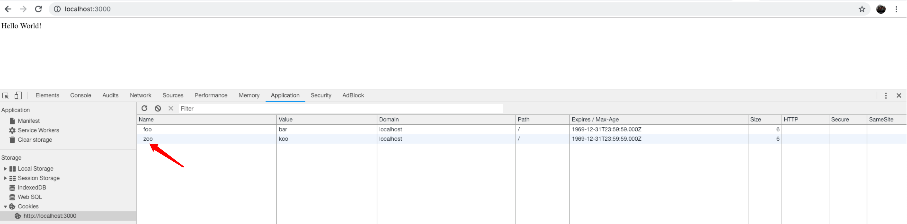
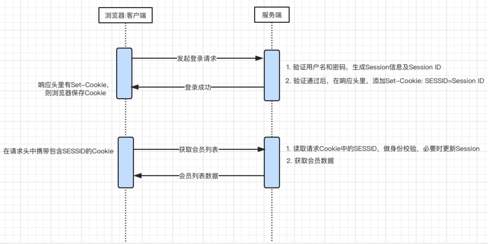

## 什么是Cookie

因为HTTP协议是无状态的，导致两个执行成功的请求之间是没有关系的。这就带来了一个问题，用户没有办法在同一个网站中进行连续的交互，比如在一个电商网站里，用户把某个商品加入到购物车，切换一个页面后再次添加了商品，这两次添加商品的请求之间没有关联，浏览器无法知道用户最终选择了哪些商品。而Cookie就是用来解决这类问题的

Cookie，又称为‘小甜饼’，是服务器发送到浏览器并保存在本地的一小块数据，**它会在浏览器下次向同一服务器再发送请求时携带并发送到服务器上（服务器可以设置或读取Cookies中包含信息）**，借此维护用户跟服务器会话中的状态。

Cookie主要用于以下三个方面：

* 会话状态管理（如用户登录状态、购物车、游戏分数或其它需要记录的信息）
* 个性化设置（如用户自定义设置、主题等）
* 浏览器行为跟踪（如跟踪分析用户行为等）

### 分类
Cookie总是保存在客户端中，可以简单的分为`会话期Cookie`和`持久性Cookie`

**会话期Cookie**是最简单的Cookie：浏览器关闭之后它会被自动删除，也就是说它仅在会话期内有效。会话期Cookie不需要指定过期时间（Expires）或者有效期（Max-Age）。需要注意的是，有些浏览器提供了会话恢复功能，这种情况下即使关闭了浏览器，会话期Cookie也会被保留下来，就好像浏览器从来没有关闭一样。

**持久性Cookie**和关闭浏览器便失效的会话期Cookie不同，持久性Cookie设置了特定的过期时间（Expires）或有效期（Max-Age）。如:

```
Set-Cookie: id=a3fWa; Expires=Wed, 21 Oct 2015 07:28:00 GMT;
```

持久性Cookie保存在硬盘里，除非用户手工清理或到了过期时间，否则Cookie不会被删除，其存在时间是长期的。

**若设置了过期时间，则是持久性Cookie（浏览器会把Cookie存成文件保存到硬盘上），未设置则是会话期Cookie （浏览器关闭时将会被删掉）**

**另外:** 登录页面上的记住我或十天内免登录的功能就是通过设置cookie的过期时间来实现的，例如把过期时间设置成十天后，就实现了十天内免登录

### 过程

#### 设置Cookie过程

以登录为例：


写代码实际操作下:

1. 配置后端服务`testServer`，在终端执行以下命令:

    ```shell
    mkdir testServer && cd testServer && touch app.js && npm init -y && npm i -D express cookie-parser
    ```

    app.js添加如下内容:

    ```js
    //app.js
    const express = require('express')
    const cookieParser = require('cookie-parser')
    const app = express();
    const port = 3000

    app.use(cookieParser())

    app.get('/', (req, res) => {
        console.log(req.cookies)

        res.append('Set-Cookie', 'foo=bar; Path=/;') // 未设置过期时间
        res.send('Hello World!')
    })

    app.listen(port, () => console.log(`Example app listening on port ${port}!`))
    ```

    在终端上执行，启动服务：

    ```shell
    node app.js
    ```

2. 打开chrome浏览器，访问`http://localhost:3000`，如下图

    首次请求时，请求头里未带cookie信息，请求响应时会携带Set-Cookie字段，告知浏览器设置cookie
    

    再次请求时，请求头里携带cookie信息，这样服务器可获取cookie
    

    查看cookie详情，未设置过期时间（Expires或者Max-Age）则是会话期Cookie （浏览器关闭将会被删掉），这里要注意2，Expires / Max-Age为1969-12-31T23:59:59.000Z 并不是过期时间，而是chrome里用来表示会话期Cookie的；在其他浏览器如Safari不是这个值，大家可以试下
    


#### 重定向Redirect时Cookie的设置

测试服务新增重定向url，如下：

```js
// app.js
...
app.get('/redirect', (req, res) => {
    res.append('Set-Cookie', 'zoo=koo; Path=/;') // 设置新cookie zoo=koo
    res.redirect(301, 'http://www.baidu.com') // 跳转至百度
})
...
```

重启服务后，浏览器访问`http://locahost:3000/redirect`后，会先设置新cookie然后跳转至百度，重新访问`http://locahost:3000`，会发现新设置的cookie，如下图



#### Set-Cookie字段的属性

服务器使用Set-Cookie响应头部向用户代理（一般是浏览器）发送Cookie信息。一个简单的Cookie可能像这样：

```html
Set-Cookie: <cookie名>=<cookie值>
```

服务器通过该头部告知客户端保存Cookie信息。

完整的Set-Cookie例子:

```html
Set-Cookie: crm=666; expires=Wed, 13-Mar-2019 12:08:53 GMT; Max-Age=31536000; path=/; domain=yaitoo.cn;secure; HttpOnly;
```

以下对属性说明：

| 属性         | 说明                                                         |
| ------------ | ------------------------------------------------------------ |
| NAME=VALUE   | 赋予Cookie的名称和值（必需项），如：crm是名字 ，666是值      |
| expires=DATE | Cookie的有效期（若不明确指定则默认为浏览器关闭前有效）       |
| path=PATH    | 将服务器上的文件目录作为Cookie的适用对象（若不指定则默认为文档所在的文件目录） |
| domain=域名  | 作为Cookie使用对象的域名（若不指定则默认为创建Cookie服务器的域名） |
| secure       | 标记为Secure的Cookie只应通过被HTTPS协议加密过的请求发送给服务端 |
| HttpOnly     | 通过JavaScript的Document.cookie API无法访问带有HttpOnly标记的Cookie |


## 什么是Session

在计算机中，尤其是在网络应用中，Session称为“会话控制”。Session对象**存储特定用户会话所需的属性及配置信息**。这样，当用户在应用程序的 Web 页之间跳转时，存储在 Session 对象中的变量将不会丢失，而是在整个用户会话中一直存在下去。

当用户请求应用程序的 Web 页时，如果该用户还没有会话，则 Web 服务器将自动创建一个 Session 对象。当会话过期或被放弃后，服务器将终止该会话。Session 对象最常见的一个用法就是存储用户的首选项。例如，如果用户指明不喜欢查看图形，就可以将该信息存储在 Session 对象中。

### 通过Cookie来管理Session

我们会使用Cookie 来管理Session，以弥补HTTP 协议中不存在的状态管理功能。以登录为例，跟上节的Cookie登录类似，只是服务端新增加对Session处理：



- 步骤一：客户端把用户名和密码等登录信息放入报文的实体部分，通常是以POST 方法把请求发送给服务器。
- 步骤二：服务器会发放用以识别用户的Session ID。通过验证从客户端发送过来的登录信息进行身份认证，然后把用户的认证状态与Session ID 绑定后记录在服务器端。
  向客户端返回响应时，会在首部字段Set-Cookie 内写入Session ID（如SESSID=028a8c…）。
  你可以把Session ID 想象成一种用以区分不同用户的等位号。然而，如果Session ID 被第三方盗走，对方就可以伪装成你的身份进行恶意操作了。因此必须防止Session ID 被盗，或被猜出。为了做到这点，Session ID 应使用难以推测的字符串，且服务器端也需要进行有效期的管理，保证其安全性。
  另外，为减轻跨站脚本攻击（XSS）造成的损失，建议事先在Cookie 内加上httponly 属性。
- 步骤三：客户端接收到从服务器端发来的Session ID 后，会将其作为Cookie 保存在本地。下次向服务器发送请求时，浏览器会自动发送Cookie，所以Session ID 也随之发送到服务器。服务器端可通过验证接收到的Session ID 识别用户和其认证状态。

## Cookie和Session区别

1. Cookie数据存放在客户端（浏览器）上，Session数据放在服务器上，但是服务端的Session的实现对客户端的Cookie有依赖关系的；
2. Cookie不是很安全，别人可以分析存放在本地的Cookie并进行Cookie欺骗，考虑到安全应当使用Session；
3. Session会在一定时间内保存在服务器上。当访问增多，会比较占用你服务器的性能。考虑到减轻服务器性能方面，应当使用COOKIE；
4. 单个Cookie在客户端的限制是4K，就是说一个站点在客户端存放的Cookie不能超过4K

## 参考

[Cookie 和 Session 关系和区别](https://juejin.im/post/5aa783b76fb9a028d663d70a)
[Cookie](https://zh.wikipedia.org/wiki/Cookie)
[HTTP cookies](https://developer.mozilla.org/zh-CN/docs/Web/HTTP/Cookies)
[认识HTTP----Cookie和Session篇](https://zhuanlan.zhihu.com/p/27669892)

## CSRF 跨站请求伪造

跨站请求伪造（英语：Cross-site request forgery），也被称为 one-click attack 或者 session riding，通常缩写为 CSRF 或者 XSRF， 是一种挟制用户在当前已登录的Web应用程序上执行非本意的操作的攻击方法。 跟跨网站脚本（XSS）相比，XSS 利用的是用户对指定网站的信任，CSRF 利用的是网站对用户网页浏览器的信任。

新建crm和attacker两个站点模拟攻击：

1. 新建crm项目：

    ```shell
    mkdir crm && cd crm && touch app.js index.html && npm init -y && npm i -D express cookie-parser body-parser
    ```

    app.js和indx.html添加如下内容：

    ```js
    // app.js
    const express = require('express')
    const cookieParser = require('cookie-parser')
    const bodyParser = require('body-parser')
    const app = express()
    const port = 3000

    app.use(express.static('./', {index: 'index.html'}));

    app.use(cookieParser())
    app.use(bodyParser.urlencoded({
        extended: true
    }))

    app.get('/cookie', (req, res) => {
        res.append('Set-Cookie', 'users=[{"username": "Lee", "age": 12}]; Path=/;')
        res.send('Welcome!你已登录 <a href="/">添加用户信息</a>')
    })

    app.post('/users', (req, res) => {
        let users = req.cookies.users? JSON.parse(req.cookies.users): []
        if(users.length == 0) {
            res.send('Sad!你未登录 <a href="/cookie">点击登录</a>')
            return
        }
        users.push(req.body)
        let usersStr = JSON.stringify(users)

        res.append('Set-Cookie', `users=${usersStr}; Path=/;`)
        res.redirect('/')
    })

    app.listen(port, () => console.log(`Example app listening on port ${port}!`))
    ```

    ```html
    // index.html
    <!DOCTYPE html>
    <html lang="en">
    <head>
        <meta charset="UTF-8">
        <meta name="viewport" content="width=device-width, initial-scale=1.0">
        <meta http-equiv="X-UA-Compatible" content="ie=edge">
        <title>Document</title>
    </head>
    <body>
        <div id="app">
            <h2>users: </h2>
            <ul>
                <li v-for="user in users"> username: {{ user.username }}, age: {{ user.age }}</li>
            </ul>

            <form action="/users" method="post">
                <label for="username">用户名</label>
                <input type="text" id="username" name="username">

                <label for="age">年龄</label>
                <input type="text" id="age" name="age">
                <button type="submit">添加</button>
            </form>
        </div>

        <script src="https://cdn.bootcss.com/vue/2.5.21/vue.min.js"></script>
        <script>
            new Vue({
                el: '#app',
                data: {
                    users: document.cookie.split('=')[1] ? JSON.parse(document.cookie.split('=')[1]): []
                }
            })
        </script>
    </body>
    </html>
    ```

    在终端执行命令：

    ```shell
    node app.js
    ```

    浏览器访问`http://localhost:3000/cookie`实现登录，可点击添加用户信息实现新增功能

2. 新建attacker项目

    ```shell
    mkdir attacker && cd attacker && touch app.js index.html && npm init -y && npm i -D express
    ```

    app.js和indx.html添加如下内容：

    ```js
    // app.js
    const express = require('express')
    const app = express();
    const port = 4000

    app.use(express.static('./', { index: 'index.html' }));

    app.listen(port, () => console.log(`Example app listening on port ${port}!`))
    ```

    ```html
    // index.html
    <!DOCTYPE html>
    <html lang="en">
    <head>
        <meta charset="UTF-8">
        <meta name="viewport" content="width=device-width, initial-scale=1.0">
        <meta http-equiv="X-UA-Compatible" content="ie=edge">
        <title>Document</title>
    </head>
    <body>
        <form action="http://localhost:3000/users" method="post">
            <label for="username">用户名</label>
            <input type="text" id="username" name="username">

            <label for="age">年龄</label>
            <input type="text" id="age" name="age">
            <button type="submit">添加</button>
        </form>
    </body>
    </html>
    ```

    在终端执行命令：

    ```shell
    node app.js
    ```

浏览器访问`http://127.0.0.1:4000`并添加用户信息，切换到crm的`http://localhost:3000`会发现attacker上新增的 数据，原理就是attacker提交用户信息的地址是crm上的`http://localhost:3000/users`，由于crm已处理登录状态(cookie有值)，所以是可以提交成功的，这就是CSRF攻击的一个例子

