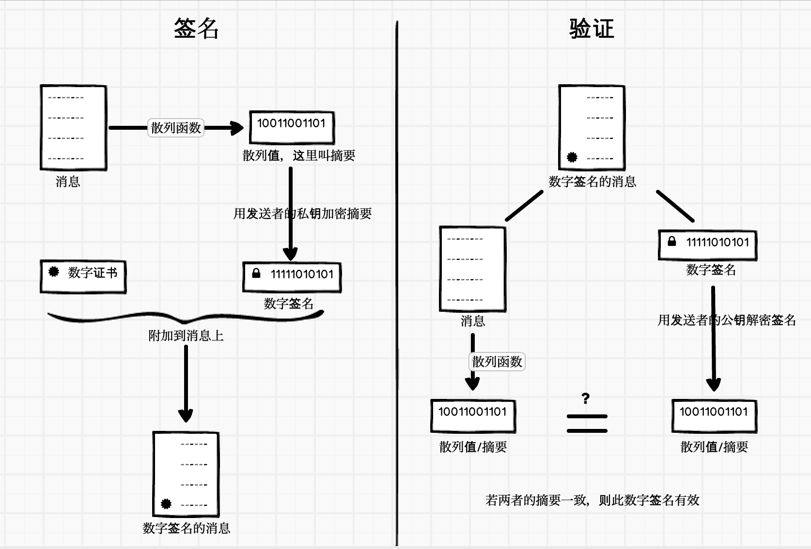
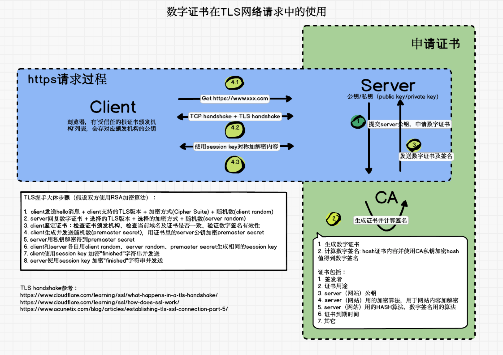

## 为什么要数字签名？

信息传输过过程中，容易被拦截篡改，比如网络调试时我们会用 Fiddler、Charles工具拦截请求修改数据，而攻击者可以入侵请求流转的服务器，在上面拦截请求并修改数据；

**数据签名就是用来保证信息传输时不被篡改，保证信息的完整性**

信息发布的目的是让人们知道信息，虽然没必要对信息进行加密，但是必须排除有人伪装信息发布者发布假信息的风险，这时信息发布者就可以使用数字签名。而对明文信息施加的签名，称为明文签名（clearsign）

在实际使用中，我们既想加密信息，又想签名，所以要对加密和签名组合使用，比如[TLS](https://zh.wikipedia.org/wiki/TLS)就组合了加密和签名

### 那什么是数字签名？

对需要加密的文本（可以是各种格式的文件），用散列/hash函数生成信息摘要，然后使用私钥对摘要内容加密，生成“数字签名”。

从字面理解是数字落款，类似写信时落款签名，表明这信息或信是谁写的，那它是如何保证信息不会被篡改呢？看下数字签名制作及验证过程：

使用信息摘要技术在数据加密传输时，发送方先对文件内容使用哈希算法进行信息摘要计算，再对摘要内容进行加密，之后将文件内容以及摘要内容（已加密）发送出去。

接收方收到数据后，先解密得到摘要内容，再依据相同的哈希算法对文件内容进行信息摘要计算，最后匹配接收到的哈希值与计算得到的哈希值是否一致，如果一致那就说明传输过程是安全的。

这样也就避免了对整体原数据加解密的计算过程，从而提高了验证效率。

>这里加解密采用非对称加密算法，使用一对公钥私钥进行的。
>
>数字签名过程涉及两类算法：一是生成摘要的hash算法，二是加密摘要的非对称加密算法

这里两个问题

1. **为什么不直接对消息加密，而是生成摘要？**

   因为对数据进行加解密时，如果数据量大（比如大文件），效率非常低的。信息摘要则是解决加密数据过大问题，其原理是对信息内容通过一个很难被逆向推导的公式计算得到一段哈希数值，它具有以下特点：

   - 计算得到的哈希值大小固定，不受原本信息内容大小的影响；
   - 不可逆，根据哈希值无法推断得到原本信息（实际上MD5以及SHA-1算法已经被证明可以被破解）；
   - 唯一性，原本信息内容一致，那么哈希值也一致；原数据不同，也不会存在重复的哈希结果。

2. **为什么要对摘要加密？**

   信息被拦截是比较容易的事情，拦截者目的可能不是看你发的什么信息，而是篡改信息，他只要替换信息内容和摘要就可以误导你了。而使用发送者私钥加密后的摘要（即数字签名），拦截者是无法替换的（他没有私钥），如果强行替换成拦截者的摘要，接收者验证会失败，因为接受者用的是发送者的公钥

> 上面讲到拦截者，除非拦截者把自己公钥发给接收者并替换原来的公钥，所以这里引入了如何证明公钥合法性问题，即数字证书

## 数字证书

讲数字证书前，先了解下CA

CA 是“Certificate Authority”的缩写，也叫“证书授权中心”。它负责管理和签发证书的第三方机构。一般来说，CA 必须是所有行业和所有公众都信任的、认可的。因此它必须具有足够的权威性。好比A、B两公司找C公司做担保，A、B都必须信任 C 公司，才会找 C 公司作中介担保。

CA为每个使用公开密钥(公钥)的用户发放一个数字证书，数字证书的作用是证明证书中列出的用户合法拥有证书中列出的公开密钥(公钥)。CA用自己的私钥，对申请用户的公钥和一些相关信息一起加密，生成"数字证书"（Digital Certificate）。使用公钥的用户(在拿到数字证书后)，使用CA公钥（如何获取CA公钥？）解开数字证书，得到用户（申请证书的用户）的公钥及其它信息，后面就可以用这个公钥与服务器交换加密信息里。公钥的合法性（是否真实用户的公钥）由CA做背书

> tls握手为什么要协商session key用于后续内容对称加密呢？最主要是对称加解密效率高，速度快