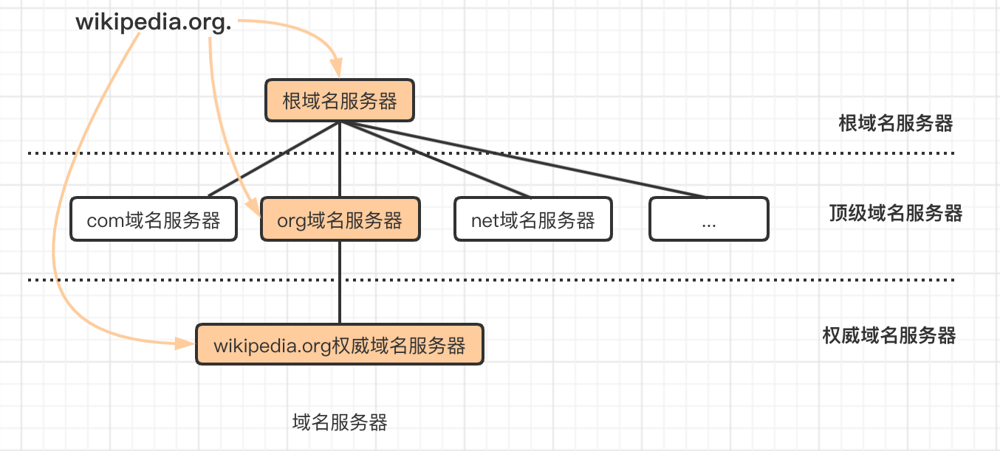

<!-- 1. dns解析过程

2. 
   概念介绍

   四种dns服务器
   
   dns两种查询方式：递归、迭代
   
      dns解析方式：正向解析、反向解析
   
      递归和迭代解释
   
      缓存解释
   
      公共dns、转发dns
   
3. 缓存刷新

## 解析过程 -->

## 四种DNS服务器

**DNS服务器**（Domain Name Server，域名服务器）是进行域名和与之相对应的IP地址进行转换的服务器。DNS服务器中保存了一张域名和与之相对应的IP地址的表，以解析消息的域名。




所有 DNS 服务器都属于以下四个类别之一：递归解析器、根域名服务器、TLD 域名服务器和权威性域名服务器。在典型 DNS 查找中（当没有正在进行的[高速缓存](https://www.cloudflare.com/learning/cdn/what-is-caching/)时），这四个 DNS 服务器协同工作来完成将指定域的 IP 地址提供给客户端的任务（`客户端`通常是一个存根解析器 - 内置于操作系统的简单解析器）。

**递归解析器（也称为 DNS 解析器或local dns server）** 是 DNS 查询中的第一站。递归解析器作为客户端与 DNS 域名服务器的中间人。从 Web 客户端收到 DNS 查询后，递归解析器将使用缓存的数据进行响应，或者将向根域名服务器发送请求，接着向 TLD 域名服务器发送另一个请求，然后向权威性域名服务器发送最后一个请求。收到来自包含已请求 IP 地址的权威性域名服务器的响应后，递归解析器将向客户端发送响应。

大多数 Internet 用户使用他们 ISP 提供的递归解析器，但还有其他可用选择；例如 [Cloudflare 的 1.1.1.1](https://www.cloudflare.com/learning/dns/what-is-1.1.1.1/)。

**根域名服务器**每个递归解析器都知道 13 个 DNS 根域名服务器，它们是递归解析器搜寻 DNS 记录的第一站。根服务器接受包含域名的递归解析器的查询，根域名服务器根据该域的扩展名（.com、.net、.org 等），通过将递归解析器定向到 TLD 域名服务器进行响应。根域名服务器由一家名为 Internet 名称与数字地址分配机构（ICANN）的非营利组织进行监督。

注意，尽管有 13 个根域名服务器，但这并不意味着根域名服务器系统中只有 13 台计算机。根域名服务器有 13 种类型，但在世界各地每个类型都有多个副本，它们使用 [Anycast 路由](https://www.cloudflare.com/learning/cdn/glossary/anycast-network/)来提供快速响应。如果您将根域名服务器的所有实例加在一起，您将有 632 台不同的服务器（截至 2016 年 10 月）。

**TLD 域名服务器**维护共享通用域扩展名的所有域名的信息，例如 .com、.net 或 url 中最后一个点之后的任何内容。例如，.com TLD 域名服务器包含以“.com”结尾的每个网站的信息。如果用户正在搜索 google.com，则在收到来自根域名服务器的响应后，递归解析器将向 .com TLD 域名服务器发送查询，后者将通过针对该域的权威性域名服务器（见下文）进行响应。

TLD 域名服务器的管理由 Internet 编号分配机构（IANA）加以处理，其为 ICANN 的一个分支机构。IANA 将 TLD 服务器分为两个主要组：

- 通用顶级域：这些是非特定国家/地区的域，一些最知名的通用 TLD 包括 .com、.org、.net、.edu 和 .gov。
- 国家/地区代码顶级域：这些包括特定于某个国家/地区或州的任何域。例如，uk、.us、.ru 和 .jp 等。

对于基础设施域实际上存在第三个类别，但该类别几乎从不使用。此类别是为 .arpa 域创建的，该域是在创建新式 DNS 时使用的过渡域；其当今主要是具有历史意义。

**权威服务器**是保存 DNS 名称记录（包括 A、AAAA 和 CNAME）的服务器。

非权威服务器根据以前的域名查询来构建缓存文件。它不存放原始名称记录。

当递归解析器收到来自 TLD 域名服务器的响应时，该响应会将解析器定向到权威性域名服务器。权威性域名服务器通常是解析器查找 IP 地址过程中的最后一步。权威名称服务器包含特定于其服务域名的信息（例如，google.com）权威性域名服务器包含特定于其所服务的域名的信息（例如 google.com），并且它可为递归解析器提供在 [DNS A 记录](https://www.cloudflare.com/learning/dns/dns-records/dns-a-record/)中找到的服务器的 IP 地址，或者如果该域具有 [CNAME 记录](https://www.cloudflare.com/learning/dns/dns-records/dns-cname-record/)（别名），它将为递归解析器提供一个别名域，这时递归解析器将必须执行全新 DNS 查找，以便从权威性域名服务器获取记录（通常为包含 IP 地址的 A 记录）。[Cloudflare DNS](https://www.cloudflare.com/dns/) 分发权威性域名服务器，这些域名服务器带有 Anycast 路由，可使其变得更可靠。


**名词解释**

**DNS Client（dns客户端）**: 机器上跑着resolver（解析器）的，resolver不是守护进程或程序，而是一组库（由应用调用）， resolver的功能是解析dns查询请求，resolver向name server发起查询，后者返回请求信息或另一个name server的引用。一旦配置了resolver，机器就可以向name server发起DNS服务请求了。详情查阅[dns clients and the resolver](https://docs.oracle.com/cd/E19683-01/817-0962/ad1intro-12450/index.html)以及[/etc/resolv.conf](https://www.huaweicloud.com/articles/449697aa71e69773cba04af2bd4395fe.html)

> mac os上有个叫mDNSResponder的进程，调用resolver库，负责解析工作

## DNS 查询有哪些类型？

典型 DNS 查找中会出现三种类型的查询。通过组合使用这些查询，优化的 DNS 解析过程可缩短传输距离。在理想情况下，可以使用缓存的记录数据，从而使 DNS 域名服务器能够返回非递归查询。

#### 3 种 DNS 查询类型：

1. **递归查询** - 在递归查询中，DNS客户端要求 DNS服务器（一般为 DNS 递归解析器）将使用所请求的资源记录响应客户端，或者如果解析器无法找到该记录，则返回错误消息。
2. **迭代查询** - 在这种情况下，DNS 客户端将允许 DNS 服务器返回其能够给出的最佳应答。如果所查询的 DNS 服务器与查询名称不匹配，则其将返回对较低级别域名空间具有权威性的 DNS 服务器的引用。然后，DNS 客户端将对引用地址进行查询。此过程继续使用查询链中的其他 DNS 服务器，直至发生错误或超时为止。
3. **非递归查询** - 当 DNS 解析器客户端查询 DNS 服务器以获取其有权访问的记录时通常会进行此查询，因为其对该记录具有权威性，或者该记录存在于其缓存内。DNS 服务器通常会缓存 DNS 记录，以防止更多带宽消耗和上游服务器上的负载。


**在介绍DNS服务器工作原理之前我们先来了解几个DNS相关的概念：**

 1、FQDN（Fully Qualified Domain Name）完全限定域名，即每个域在全球网络都是唯一的；同时带有主机名和域名的名称

```
FQDN = Hostname + DomainName
```

如：

```
主机名 baike
域名 baidu.com
FQDN = baike.baidu.com
```


权威DNS服务器需要在域名注册商那里注册之后才能真正作为权威 DNS 服务器来使用，不同域名注册商步骤不一


解析器 即resolver，处于DNS客户端的一套系统，用于实现正向解析或者反向解析。

**递归DNS 又叫local dns**。递归DNS可以理解为是一种功能复杂些的resolver，其核心功能一个是缓存、一个是递归查询。收到域名查询请求后其首先看本地缓存是否有记录，如果没有则一级一级的查询根、顶级域、二级域……直到获取到结果然后返回给用户。日常上网中运营商分配的DNS即这里所说的递归DNS。
本地递归服务器一般由电信运营商架设，服务于自己的用户，并有其管理，自然人也架设。根服务器与顶级域服务器由国际组织统一部署管理（实际控制器在美国政府）。对顶级域服务器来说销售商有可控的写入权


权威DNS 处于DNS服务端的一套系统，该系统保存了相应域名的权威信息。权威DNS即通俗上“这个域名我说了算”的服务器。各大互联网

转发DNS 转发DNS是一种特殊的递归。如果本地的缓存记录中没有相应域名结果时，其将查询请求转发给另外一台DNS服务器，由另外一台DNS服务器来完成查询请求。


公共DNS 公共DNS属于递归DNS。其典型特征为对外一个IP，为所有用户提供公共的递归查询服务。

<!-- ## 缓存 -->

参考: [DNS 服务器有哪些不同类型](https://www.cloudflare.com/zh-cn/learning/dns/dns-server-types/#recursive-resolver)