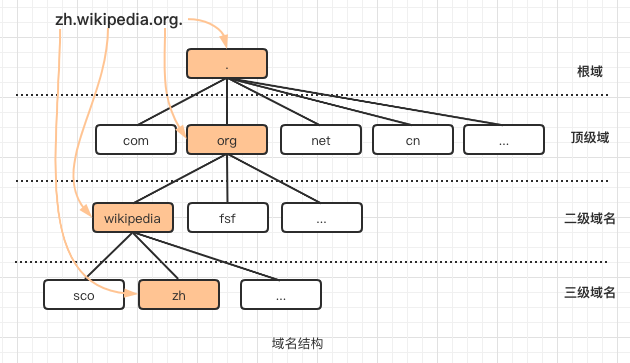

## name servers介绍及历史

本篇文章我们会讨论互联网世界里最重要和不可避免的资源，我们每个人有意或无意地使用它。

网络中的每台机器都是由一个ip（数字地址）标识。这个地址可以被网络中的其它机器使用，以便进行通信。在没有和这个ip地址相关的名称时，ip地址难以记忆，即使本地网络少量机器地址也难以记住，更不用说网络中成千上万机器地址了。

最初主机文件（hosts file， [hosts file介绍看这里](http://www.steves-internet-guide.com/hosts-file/)）的概念是为了解决这个问题而诞生的，网络中的每一台机器都有一个主机文件（Un*x下是/etc/hosts)，记录了主机名称（computer name/host name）跟IP地址映射关系（dns出现后也可以记录域名和ip映射关系），转换为IP地址就是在这里完成的。有了hosts file，只要记住主机名称即可，通过目标机器的主机名称来访问目标机器，不需要再记ip地址了。


但随时间推移，网络中机器越来越多且不同网络间通信需求，hosts file方式暴露了一些问题：

1. 每次出现新机器时，网络中其它机器都要更新映射关系
2. 没有有效的机制，通知这些机器去更新映射关系
3. 随时间推移，主机文件越来越大，很难维护

hosts file适用于机器较少的本地网络，不适用于分布在不同网络上的大量机器场景

在1970年中期，name server（名称服务器）的概念出现了。这个name server背后的基本思想是，人们发现名称比起数字更容易记，特别是当名称描述资源的一些属性时。而名称转换为ip的问题与计算机网络本身一样古老。

当网络中有name server时，网络中的其它机器只要知道name server的ip地址以及目标机器或网站的名称。有了这些信息后就可以跟name server请求目标机器的ip地址。

中心化的name server服务器比起[hosts file](http://www.steves-internet-guide.com/hosts-file/)主机文件方案要好的多，因为现在有了专门用于名称到地址映射的中心化服务器，网络中机器只要记住它的ip，然后向它发起查询请求即可返回名称对应的ip地址。

中心化的name server主要好处是机器修改ip地址后，不需要通知网络中其它机器了，机器ip修改后，只需要在name server上更新下最新ip地址即可。缺点也显而易见，服务器挂的话整个网络访问都不可用了，所以出现了多台name server的方案，一个作为master或primary，其它作为slave或secondary，如果master不可用则slave提供查询服务。

即使是多台name server的实现也有一些缺点：

1. 随着网络中名称不断增加，name server从数百万个条目中检索信息变得非常困难，所以我们需要一种方法来组织这些名称。

2. 想象单台name server每秒执行越来越多请求，这种情况下name server负载会增加，所以我们需要想办法分散负载。
3. 我们需要一种机制来分离name server上的条目管理，以便不同管理员可以添加条目。

为了有效的管理名称或域名的解析（解析成IP地址）工作，随后设计了DNS（域名系统）

## DNS(Domain Name System) 域名系统

`域名结构`和`域名系统`是为了在大型分布式网络中组织和查找计算机ip地址而开发的。在域名结构出现之前，通过上文提到的hosts file来记录主机名称和ip地址映射关系

在介绍dns之前，先看下域名结构。



DNS系统设计成一个与域名结构类似的倒树层次化的dns名称服务器结构，树根叫root name server（根名称服务器），接着是TLD name server（顶级域名称服务器），TLD后是SLD name server（二级域/权威名称服务器）

> 完整的dns功能描述请查阅RFC [1034](https://tools.ietf.org/html/rfc1034) [1035](https://tools.ietf.org/html/rfc1035)

dns系统中，每个节点都被分配给一个权威机构或组织进行管理。负责特定节点的组织是该节点的权威。

现在位于dns系统层次顶端的是根名称服务器，它是由ICANN这个组织管理。

gTLD通用顶级域名称服务器如（.com, .net）等也是由ICANN管理并委托给注册管理机构，ccTLD国家顶级域名称服务器被授权给不同国家进行管理

>在域名中，经常出现的www（如www.baidu.com）是主机名称，仅仅是个惯例，你也可以叫 xyz.baidu.com

当我在浏览器地址栏上输入www.example.com回车时会发生什么？

在名称服务器层级里，根名称服务器是最重要资源，当其它名称服务器查询不到信息时，它们首先会请求根名称服务器。

全球有13组根服务器：

```
a.root-servers.net.
b.root-servers.net.
c.root-servers.net.
d.root-servers.net.
e.root-servers.net.
f.root-servers.net.
g.root-servers.net.
h.root-servers.net.
i.root-servers.net.
j.root-servers.net.
k.root-servers.net.
l.root-servers.net.
m.root-servers.net.
```

这些服务器地址已默认内置到所有dns软件包里，也就是说所有名称服务器都能直接访问根服务器，而不需要通过其它名称服务器。


Setp1: 在客户端浏览器输入www.example.com

Setp2: 操作系统会先查找 hosts file (/etc/host)以便获取www.example.com的ip地址（这个机制可以在配置里修改[/etc/nsswitch.conf](http://www.faqs.org/docs/securing/chap6sec71.html)），然后查找机器配置的dns server ip地址（u*ix下是/etc/resolv.conf）

Setp3: dns server从自己库里搜索www.example.com的ip，如果找到了则返回，否则它会向根名称服务器发起查询

Setp4: 根名称服务器会返回负责`.com`顶级域解析的服务器地址（顶级域名称服务器知道它子域服务器地址）。这个例子里是www.example.com，所以会返回.com顶级域服务器地址

如果输入的是www.example.net，则会返回.net顶级域服务器地址

Setp5: `.com`顶级域服务器中的一个会返回负责解析example.com域名的dns server地址

Setp6: example.com域名的dns server返回www主机的ip地址

我们实际看下这个处理过程：

```
[root@myvm1 ~]# dig +trace www.google.com

; <<>> DiG 9.3.4-P1 <<>> +trace www.google.com
;; global options:  printcmd
.                       5       IN      NS      a.root-servers.net.
.                       5       IN      NS      b.root-servers.net.
.                       5       IN      NS      c.root-servers.net.
.                       5       IN      NS      d.root-servers.net.
.                       5       IN      NS      e.root-servers.net.
.                       5       IN      NS      f.root-servers.net.
.                       5       IN      NS      g.root-servers.net.
.                       5       IN      NS      h.root-servers.net.
.                       5       IN      NS      i.root-servers.net.
.                       5       IN      NS      j.root-servers.net.
.                       5       IN      NS      k.root-servers.net.
.                       5       IN      NS      l.root-servers.net.
.                       5       IN      NS      m.root-servers.net.
;; Received 228 bytes from 192.168.159.2#53(192.168.159.2) in 49 ms

com.                    172800  IN      NS      a.gtld-servers.net.
com.                    172800  IN      NS      b.gtld-servers.net.
com.                    172800  IN      NS      c.gtld-servers.net.
com.                    172800  IN      NS      d.gtld-servers.net.
com.                    172800  IN      NS      e.gtld-servers.net.
com.                    172800  IN      NS      f.gtld-servers.net.
com.                    172800  IN      NS      g.gtld-servers.net.
com.                    172800  IN      NS      h.gtld-servers.net.
com.                    172800  IN      NS      i.gtld-servers.net.
com.                    172800  IN      NS      j.gtld-servers.net.
com.                    172800  IN      NS      k.gtld-servers.net.
com.                    172800  IN      NS      l.gtld-servers.net.
com.                    172800  IN      NS      m.gtld-servers.net.
;; Received 504 bytes from 198.41.0.4#53(a.root-servers.net) in 153 ms

google.com.             172800  IN      NS      ns2.google.com.
google.com.             172800  IN      NS      ns1.google.com.
google.com.             172800  IN      NS      ns3.google.com.
google.com.             172800  IN      NS      ns4.google.com.
;; Received 168 bytes from 192.33.14.30#53(b.gtld-servers.net) in 12 ms

www.google.com.         300     IN      A       74.125.236.48
www.google.com.         300     IN      A       74.125.236.50
www.google.com.         300     IN      A       74.125.236.51
www.google.com.         300     IN      A       74.125.236.49
www.google.com.         300     IN      A       74.125.236.52
;; Received 112 bytes from 216.239.34.10#53(ns2.google.com) in 108 ms
```

这个是dig的完整输出，请求首先发送到根名称服务器，a.root-servers.net 响应所有`.com`顶级域服务器地址，然后b.gtld-servers.net 返回负责google.com解析的名称服务器地址，最后ns2.google.com 返回了www.google.com域名的ip地址


**名词解释**

* **DNS**
  DNS 的全称是 Domain Name *System*, 很多人会误以为是 Domain Name *Server*. DNS 是一套系统, 负责将域名与 IP 地址相对应起来

* **Name server（名称服务器）**
  负责实现 DNS 这套系统的服务器, 有时候也叫做 `DNS server（dns服务器）`, 这也是为什么许多人会将 name server 同 DNS 搞混起来的原因.

  root server/tld name server/tld server/dns server
   
参考：    
[DNS 和 Nameserver 的区别](https://yoncise.com/2013/07/03/DNS-%E5%92%8C-Nameserver-%E7%9A%84%E5%8C%BA%E5%88%AB/)    
[Understanding and Using The Hosts File-Beginners Guide](http://www.steves-internet-guide.com/hosts-file/)