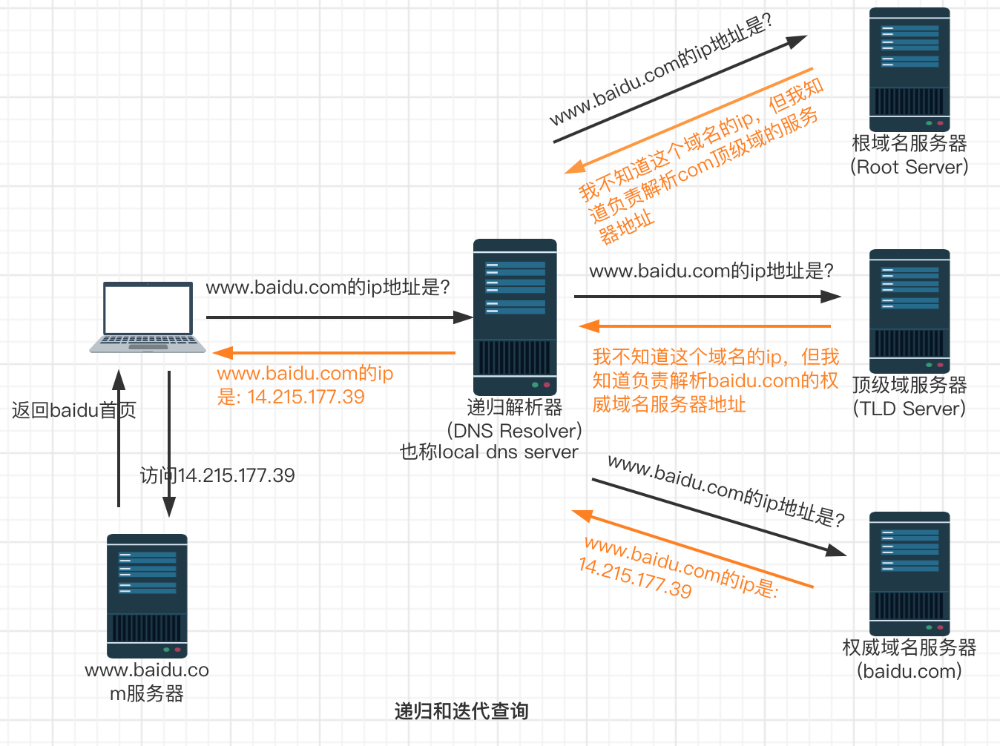

# dns迭代查询和递归查询定义及区别

DNS系统是用来解析完全限定域名（fully qualified domain name (FQDN)）为相应ip地址的，这个解析过程叫做域名解析(name resolution)。

递归查询时，dns client只发一次解析请求，返回的结果只有两种：name resolution（查询成功）或 错误消息（查询失败）。递归查询发生在dns client和local dns server之间。

迭代查询发生在local dns server和其它dns servers之间，迭代查询并不强制要求返回name resolution，也就是其它dns servers如果知道域名解析则返回解析结果，也可以返回referral。

以浏览器访问www.baidu.com为例：

1. 浏览器首先会检查两个地方是否有之前解析google网站的记录，一个地方是电脑上的缓存（window上查看dns缓存：ipconfig/displaydns），另一个是hosts文件。

2. 假设这两地方都没有解析记录，电脑（dns client）将向我的local dns server发起查询：“我想知道www.baidu.com的ip地址”；**从dns client到local dns server的查询称为递归查询，dns client要求获得一个明确的结果（name resolution或error message），local dns server负责返回解析结果**。

3. 假设local dns server上没有缓存www.baidu.com的ip地址，接下来就是进行迭代查询，迭代查询期间，其它dns servers不知道ip地址的话，会简单返回referral，具体如下：

   local dns server首先向根域服务器发起查询，根域服务器只负责顶级域解析，如.com, .edu, .org等，这里根域服务器返回.com顶级域服务器地址，同时也称为根域服务器返回一个referral。

   接着local dns server向.com顶级域名服务器发起查询，.com顶级域名服务器返回baidu.com权威服务器地址。

   然后local dns server向baidu.com权威服务器地址发起查询，baidu.com权威服务器返回www.baidu.com的ip地址。

   最后local dns server把解析结果返回给电脑（dns client）。

4. 电脑（dns client）收到结果后，把ip地址缓存起来，供下次使用；local dns server也会缓存解析结果，这样网络中的其它电脑就可以直接拿到结果了，而不需要再走一遍迭代查询流程。

总结下，dns递归查询发生在dns client和local dns server之间，local dns server负责响应dns client的请求，当local dns server不知道域名ip时，则向其它dns servers发起迭代查询，并返回最终结果给dns client。

> 这里递归查询是从电脑端角度看，迭代查询是从local dns server角度。dns client设置使用的DNS服务器一般都是递归服务器，它负责全权处理客户端的DNS查询请求，直到返回最终结果。而DNS服务器之间一般采用迭代查询方式。

这里迭代查询有两种说法，一种是上面描述的，在local dns server和其它dns server之前进行的迭代查询，另外一种是dns client和其它dns server进行的迭代查询，[查阅1](https://www.slashroot.in/difference-between-iterative-and-recursive-dns-query)、[查阅2](http://www.prohut.net/blogging/recursive-query-vs-iterative-query-dns/)、[查阅3](https://www.omnisecu.com/tcpip/recursive-and-iterative-dns-queries.php)

**名词解释**

1. **dns client（dns客户端）**

   跑着resolver（解析器）的机器，resolver不是守护进程或程序，而是一组库（由应用调用）， resolver的功能是解析dns查询请求，resolver向name server发起查询，后者返回请求信息或另一个name server的引用。一旦配置了resolver，机器就可以向name server发起DNS服务请求了。详情查阅[dns clients and the resolver](https://docs.oracle.com/cd/E19683-01/817-0962/ad1intro-12450/index.html)以及[/etc/resolv.conf](https://www.huaweicloud.com/articles/449697aa71e69773cba04af2bd4395fe.html)。

   >mac os上有个叫mDNSResponder的进程，调用resolver库，负责解析工作

2. **dns server（dns服务器）**
   负责实现 DNS 这套系统的服务器，有时候也叫做 `Name server（名称服务器）`, 这也是为什么许多人会将 name server 同 DNS 搞混起来的原因.

   root server/tld name server/tld server/dns server

3. **FQDN（Fully Qualified Domain Name）完全限定域名**，即每个域在全球网络都是唯一的；同时带有主机名和域名的名称。

   >FQDN = Hostname(主机名) + DomainName(域名)
   >如：主机名 baike，域名 baidu.com，则FQDN = baike.baidu.com

4. **referral** （引用）

   dns系统中的服务器返回referral，表明该服务器不是权威服务器，需要将查询重定向到另一个更合适的服务器。