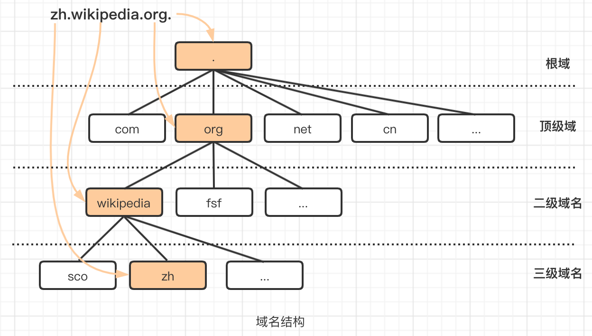
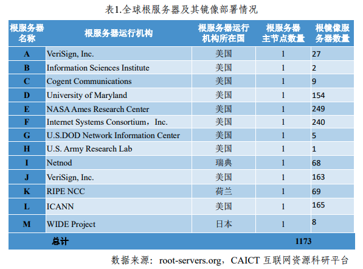
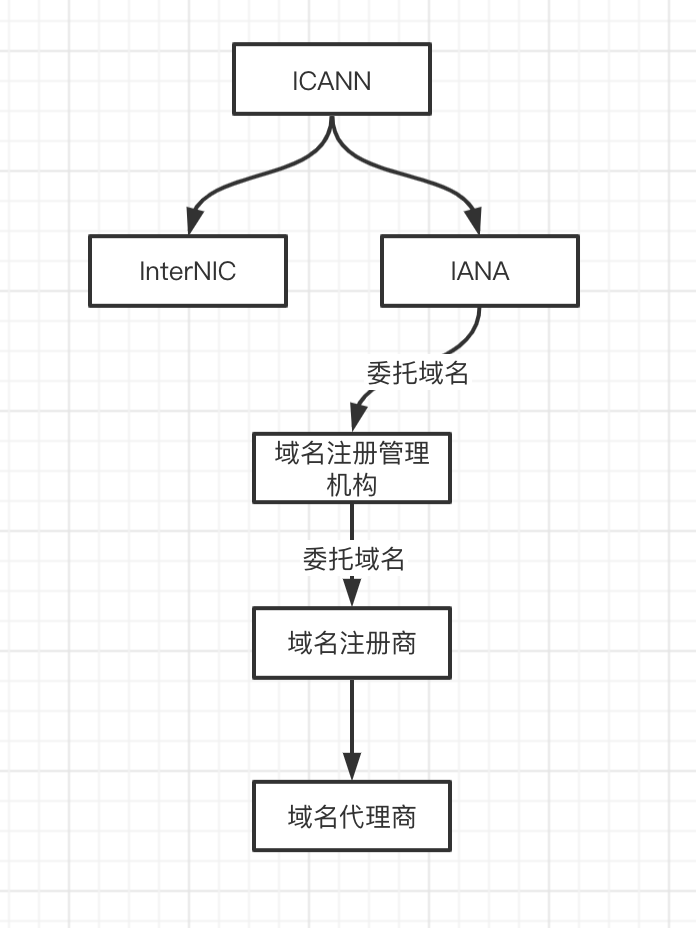
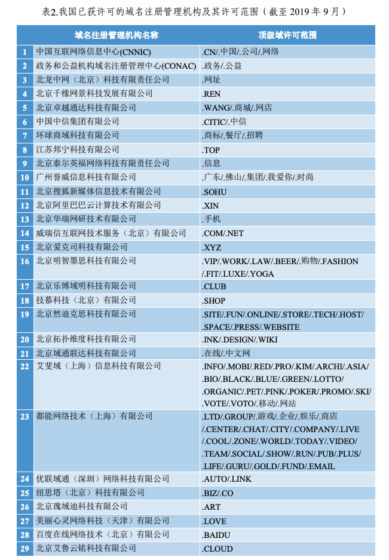
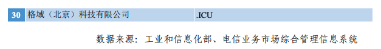
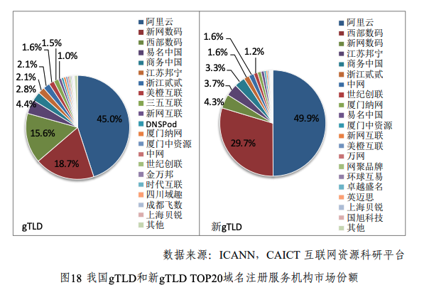

## 域名空间结构

1. **根域**：标识为` .` 点，对应全球13组根域名服务器以英文字母A到M依序命名，域名格式为`字母.root-servers.net`。其中有11个是以任播技术在全球多个地点设立镜像站。比如中国大陆在北京有两台编号为L的镜像，编号为F、I、J的镜像各一台，共5台；香港有编号为D、J的镜像各2台，编号为A、F、I、L的镜像各一台，共8台；台湾则有编号为F、I、J各一台，共3台。如下图截止2019年根域和镜像服务器数量

2. **顶级域**（Top Level Domain，简称TLD），如.com, .cn, .top等，顶级域分为三类

    * **通用顶级域名gTLDs（generic top-level domains）**，诸如 .com(商业机构) .org(非营利性组织) .net(网络服务机构)等

    * **国家顶级域名ccTLDs（country code top-level domains）**，诸如 .cn(中国) .uk(英国) .us(美国) .jp(小日本)

      国家地区顶级域被`IANA`委托给国家性的`域名注册管理机构`来管理，比如德国的DENIC、英国的Nominet、中国大陆的CNNIC、台湾的TWNIC等。

    * **新通用顶级域名（New gTLD）**，如通用的.xyz、代表“高端”的.top、代表“红色”的.red、代表“人”的.men等

3. **子域名**(二级域名)，即顶级域名的子域名(也有叫主域名)，如 example.com, example.net, example.top 等

4. **三级域名**，即二级域名的子域名，如 abc.example.com, abc.example.net 等

5. 以此类推，在上一级域名最左侧进行域名级别的拓展，def.abc.example.com、def.abc.example.net、def.abc.example.org等

## 域名组织机构

**ICANN**（互联网名称与数字地址分配机构）是一家非营利私人组织，是互联网的管理机构。
ICANN 负责域名系统 (DNS) 的技术运营，并负责制定政策来规定互联网的名称和地址的工作原理。
`InterNIC` 和` IANA `是由 ICANN 运营的两个组织。

**InterNIC**：网络信息中心 (InterNIC) 提供关于域名注册服务的信息。

**IANA**（互联网号码分配机构）是一家互联网地址指派机构，管理国际互联网中使用的`IP地址`、`域名`和许多其它参数的机构。IANA 将对所有其他网域（非根网域）的管辖权委托给其他域名注册管理机构。负责运营域名系统根区域、委派顶级域名的管理，并负责.int和.arpa两个域名的管理。

**域名注册管理机构**是管理一个或多个顶级或下级域名的组织。例如，Verisign 负责维护若干个顶级域名，包括 .com、.net 和 .name 域名。域名注册管理机构通过` IANA `获得某个顶级域名的管辖授权。

每个`域名注册管理机构`均管理着其管辖范围内域名和子域名的管理数据。此类数据管理包括含有每个域名的域名服务器地址和注册者信息的区文件。

国家及地区顶级域（Country code top-level domains，ccTLD）被`IANA`委托给国家性的`域名注册管理机构`来管理，比如德国的DENIC、英国的Nominet、中国大陆的CNNIC、台湾的TWNIC等。

>截至 2019 年 9 月，已有 30 家**域名注册管理机构**获准在我国境内运营和管理 112 个顶级域（详见表2），135 家域名注册服务机构（**域名注册商**）获准按相应的域名注册服务项目提供服务

	

**域名注册商（domain name registrar）**处理域名保留（注册）以及为这些域名分配 IP 地址的公司，例如阿里万网、新网等。应注意的是，域名注册商实际上并不管理和维护域名；该部分由域名注册管理机构完成。

`域名注册商`往往提供多个顶级域服务（域名注册管理），但每个顶级域是由不同的`域名注册管理机构`维护的，所以要成为某个顶级域的注册商，需得到`ICANN`和该顶级域的`域名注册管理机构`的授权。例如，VeriSign是 “.com”域的注册商。当域名注册商向用户出售“.com”域名注册时，域名注册商必须通知 VeriSign 以便正确保留该域。域名注册商还必须向 VeriSign 支付费用，该费用已计入域名注册商向最终用户收取的价格中。

下图是截止2019年6月，我国gTLD和new gTLD 前20域名注册商市场份额。

**域名代理商** 除了域名注册商外，还有一些域名代理商出售域名注册。这些代理商代表注册商出售域名，以收取中间人报酬。尽管这些代理商是合法的，但通常只是副业，并且可能缺乏专门的客户支持。

代理商的网站很少明确表明自己是代理商，因此可能难以和注册商区分。幸运的是，有一种简单的方法可以知道一家公司是否为合法的注册商：ICANN 在其网站上公布了各个认证并有效的域名注册商的名单。

## 域名注册过程

1. `域名注册人`在`域名注册商`处登记域名信息后，域名注册管理机构和域名注册商通常会收取费用，一般是按域名的有效期计算，单位是年。
2. 收到费用后，向`域名注册管理机构`发去注册信息，后者授权前者在相应的顶级域名中分配名称，并使用一种特殊协议——[WHOIS](https://zh.wikipedia.org/wiki/WHOIS)协议，发布域名注册信息。
3. 最后，`域名注册商`将域名的使用权限发放给`域名注册人`。此交易在注册商的角度看，被称为域名的销售或租赁；在注册人的角度看，被称为域名的注册或购买。目前，这一过程大多已经自动化。`顶级域名注册管理机构`和`域名注册商`的完整列表由ICANN发布。

“拥有”域名是什么意思？

尽管人们经常谈论购买和拥有域名，但事实是注册管理机构拥有所有的域名，而注册商只是为客户提供在有限时间内保留这些域名的机会。

域名的最长保留期限为十年。用户可以保留域名的时间则超过十年，因为注册商可以无限续期保留，但是用户从不真正拥有该域名，而只是在租用。

参考：   
[互联网名称与数字地址分配机构](https://zh.wikipedia.org/wiki/%E4%BA%92%E8%81%94%E7%BD%91%E5%90%8D%E7%A7%B0%E4%B8%8E%E6%95%B0%E5%AD%97%E5%9C%B0%E5%9D%80%E5%88%86%E9%85%8D%E6%9C%BA%E6%9E%84)    
[互联网行业季报2019第三季度](https://www.miit.gov.cn/n1146285/n1146352/n3054355/n3057709/n3057722/c7551763/part/7551769.pdf)      
[注册商和域名注册管理机构简介](https://support.google.com/domains/answer/3251189#zippy=%2C%E5%9F%9F%E5%90%8D%E6%B3%A8%E5%86%8C%E7%AE%A1%E7%90%86%E6%9C%BA%E6%9E%84%2C%E6%B3%A8%E5%86%8C%2C%E6%B3%A8%E5%86%8C%E5%95%86%2C%E6%B3%A8%E5%86%8C%E8%80%85)    
[Understanding The Domain Name Structure](http://www.steves-internet-guide.com/domain-name-structure/)    
[DNS服务简介和配置详解](https://blog.51cto.com/longlei/2053983)    
[使用bind搭建权威DNS、智能DNS](https://blog.csdn.net/han156/article/details/78239932)    
[域名](https://zh.wikipedia.org/wiki/%E5%9F%9F%E5%90%8D)