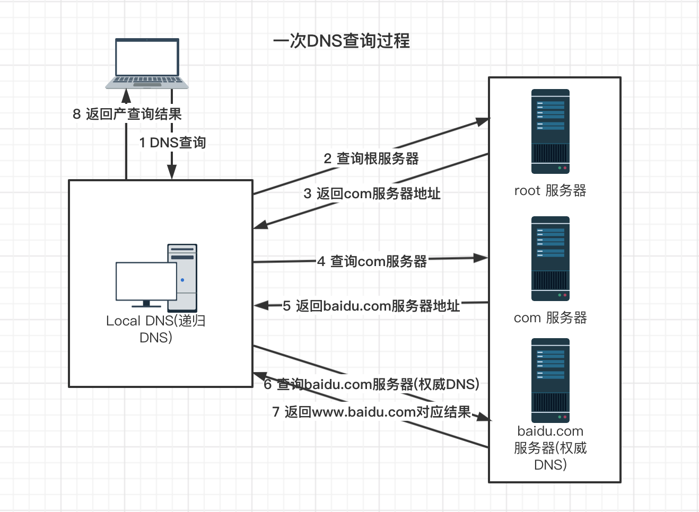

## 域名查询过程

以用户在浏览器输入www.baidu.com为例，我们详细说明一下实际域名查询过程：

1. 用户输入www.baidu.com，浏览器调用操作系统resolver发起域名查询，此处不考虑浏览器的域名缓存；resolver封装一个dns请求报文，并将其发给运营商分配的local dns地址（或者用户自己配置的公共dns）；

2. local dns查询缓存，如果命中则返回响应结果；否则向根服务器发起查询；

3. 根服务器返回顶级域com的服务器地址。每一层级的DNS服务器都有缓存，实际都是先查缓存，没有缓存才返回下级域，此处不再重复；

4. local dns查询com。com返回baidu.com地址；

5. local dns查询baidu.com，baidu.com返回www.baidu.com对应记录结果。

## 名词解释

**解析器 即resolver：** 处于DNS客户端的一套系统，用于实现正向解析或者反向解析。

**Local DNS(递归dns)：** 个人电脑使用的DNS server是路由器上的dns server，一般路由器使用运营商dns server，运营商（如缓存等）那查不到结果，则进入迭代dns查询（就是查询根服务器到权威dns返回结果）。

递归DNS可以理解为是一种功能复杂些的resolver，其核心功能一个是缓存、一个是递归查询。收到域名查询请求后其首先看本地缓存是否有记录，如果没有则一级一级的查询根、顶级域、二级域……直到获取到结果然后返回给用户。日常上网中运营商分配的DNS即这里所说的递归DNS。

**权威DNS：** 处于DNS服务端的一套系统，该系统保存了相应域名的权威信息。权威DNS即通俗上“这个域名我说了算”的服务器。

**转发DNS：** 转发DNS是一种特殊的递归。如果本地的缓存记录中没有相应域名结果时，其将查询请求转发给另外一台DNS服务器，由另外一台DNS服务器来完成查询请求。

**公共DNS：** 公共DNS属于递归DNS。其典型特征为对外一个IP，为所有用户提供公共的递归查询服务。
