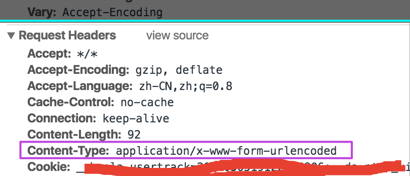
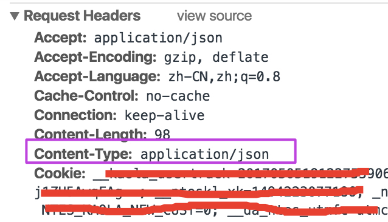
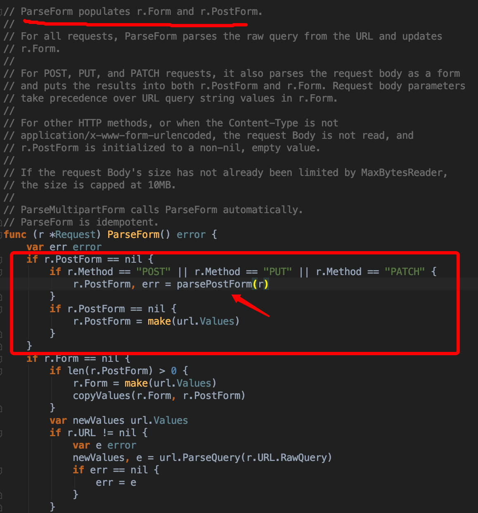
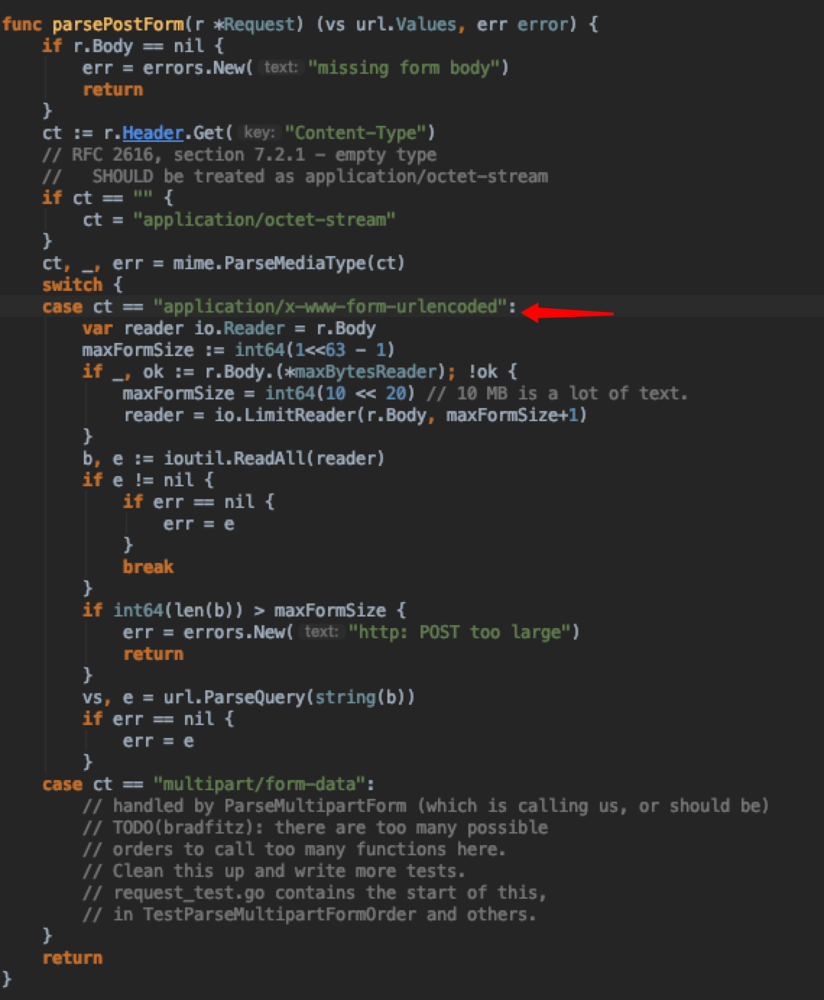

## 理论

## POST数据提交方式


HTTP/1.1 协议规定的 HTTP 请求方法有 OPTIONS、GET、HEAD、POST、PUT、DELETE、TRACE、CONNECT 这几种。其中 POST 一般用来向服务端提交数据，本文主要讨论 POST 提交数据的几种方式。

我们知道，HTTP 协议是以 ASCII 码传输，建立在 TCP/IP 协议之上的应用层规范。规范把 HTTP 请求分为三个部分：`状态行、请求头、消息主体`。类似于下面这样：
```html
<method> <request-URL> <version>
<headers>

<entity-body>
```
协议规定 **POST 提交的数据必须放在消息主体（entity-body）中，但协议并没有规定数据必须使用什么编码方式**。实际上，开发者完全可以自己决定消息主体的格式，只要最后发送的 HTTP 请求满足上面的格式就可以。

但数据发送出去，还要服务端能解析才行。一般服务端语言如 php、python 等，以及它们的 framework，都内置了自动解析常见数据格式的功能。**服务端通常根据请求头（headers）中的 Content-Type 字段来获知请求中的消息主体是用何种方式编码，再对主体进行解析。**所以说到 POST 数据提交方案，包含了 Content-Type 和消息主体编码方式两部分。这里摘录两种Content-Type，其它参阅[参阅](https://imququ.com/post/four-ways-to-post-data-in-http.html#toc-2)

### application/x-www-form-urlencoded
这应该是最常见的 POST 提交数据的方式了。浏览器的原生 <form> 表单，如果不设置 enctype 属性，默认以 `application/x-www-form-urlencoded` 方式提交数据。请求类似于下面这样（无关的请求头在本文中都省略掉了）：

```text
POST http://www.example.com HTTP/1.1
Content-Type: application/x-www-form-urlencoded;charset=utf-8

title=test&sub%5B%5D=1&sub%5B%5D=2&sub%5B%5D=3
```

首先，`Content-Type` 被指定为 application/x-www-form-urlencoded；其次，提交的数据按照 `key1=val1&key2=val2 `的方式进行编码，key 和 val 都进行了 URL 转码。大部分服务端语言都对这种方式有很好的支持。例如 PHP 中，`$_POST['title']` 可以获取到 title 的值，`$_POST['sub']` 可以得到 sub 数组。

>很多时候，我们用 Ajax 提交数据时，也是使用这种方式。例如 JQuery 和 axios 的 Ajax，Content-Type 默认值都是「application/x-www-form-urlencoded;charset=utf-8」。

### application/json

`application/json` 这个 Content-Type 大家肯定不陌生。如今越来越多的人把它作为请求头，**用来告诉服务端消息主体是序列化后的 JSON 字符串**。由于 JSON 规范的流行，除了低版本 IE 之外的各大浏览器都原生支持 JSON.stringify，服务端语言也都有处理 JSON 的函数，使用 JSON 不会遇上什么麻烦。

JSON 格式支持比键值对复杂得多的结构化数据，这一点也很有用。记得我几年前做一个项目时，需要提交的数据层次非常深，我就是把数据 JSON 序列化之后来提交的。不过当时我是把 JSON 字符串作为 val，仍然放在键值对里，以 x-www-form-urlencoded 方式提交。

Google 的 AngularJS 中的 Ajax 功能，默认就是提交 JSON 字符串。例如下面这段代码：

```js
var data = {'title':'test', 'sub' : [1,2,3]};
$http.post(url, data).success(function(result) {
    ...
});
```
最终发送的请求是：
```text
POST http://www.example.com HTTP/1.1
Content-Type: application/json;charset=utf-8

{"title":"test","sub":[1,2,3]}
```

这种方案，可以方便的提交复杂的结构化数据，特别适合 RESTful 的接口。各大抓包工具如 Chrome 自带的开发者工具、Firebug、Fiddler，都会以树形结构展示 JSON 数据，非常友好。但也有些服务端语言还没有支持这种方式，例如 php 就无法通过 $_POST 对象从上面的请求中获得内容，go parseForm不支持。这时候，需要自己动手处理下：在请求头中 Content-Type 为 application/json 时，从 消息主体（entity-body）获取数据，再反序列化。

当然 AngularJS 也可以配置为使用 x-www-form-urlencoded 方式提交数据。

### POST请求中，Form Data与Request Payload区别

上节说了**http协议并没有规定消息主体（entity-body）里的数据必须使用什么编码方式**，但实际多使用Form Data和Request Payload方式：

#### Form Data

当POST请求的请求头里设置`Content-Type: application/x-www-form-urlencoded`(默认), 参数在请求体(消息主体)以标准的Form Data的形式提交，以&符号拼接，参数格式为：`key=value&key=value&key=value…`

{:.shadow height="70%" width="70%"}

前端代码设置：

```js
xhr.setRequestHeader('Content-type', 'application/x-www-form-urlencoded');
xhr.send('a=1&b=2&c=3');
```

#### Request Payload

如果使用AJAX原生POST请求,请求头里设置`Content-Type:application/json`，请求的参数会显示在Request Payload中，参数格式为JSON格式：`{"key":"value","key":"value"…}`，这种方式可读性会更好。
{:.shadow height="70%" width="70%"}

#### 两者 区别
如果请求头里设置`Content-Type: application/x-www-form-urlencoded`，那么这个请求被认为是表单请求，参数出现在Form Data里，格式为`key=value&key=value&key=value...`

原生的AJAX请求头里设置`Content-Type:application/json`，或者使用默认的请求头Content-Type:text/plain;参数会显示在Request payload块里提交。

## 实验
新建测试服务，main.go文件代码如下：
```go
package main

import (
  "encoding/json"
  "fmt"
  "io/ioutil"

  "net/http"
)

func main(){
  http.HandleFunc("/", func(w http.ResponseWriter, r *http.Request) {

    if err := r.ParseForm(); err != nil {
      fmt.Fprintf(w, "ParseForm() err: %v\n", err)
    }

    fmt.Fprintf(w, "Post from curl! r.PostForm = %v\n", r.PostForm)

    name := r.FormValue("name")
    age := r.FormValue("age")
    fmt.Fprintf(w, "Name = %s\n", name)
    fmt.Fprintf(w, "Age = %s\n\n\n", age)

    fmt.Fprintf(w, "Welcome to my website!\n\n\n")

    ct := r.Header.Get("Content-Type")
    if ct == "application/json"{
      fmt.Fprintf(w, "===Content-Type: application/json===\n")

      buf, err := ioutil.ReadAll(r.Body)
      if err != nil {
        fmt.Fprintf(w, "ReadAll r Body err: %v\n", err)
      }
      fmt.Fprintf(w, "post data: %s\n", string(buf))

      var result map[string]interface{}
      json.Unmarshal(buf, &result)

      for k, v := range result {
        fmt.Fprintf(w, "%s = %s\n", k, v)
      }
    }
  })

  http.ListenAndServe(":8881", nil)
}
```
起服务：
```shell
go run main.go
```
**使用curl以`post Content-Type:application/x-www-form-urlencoded`方式访问：**

```shell
curl -i -H 'Content-Type:application/x-www-form-urlencoded' -X POST http://localhost:8881 -d "name=123&age=123"
```
返回结果：
```text
HTTP/1.1 200 OK
Date: Thu, 14 Mar 2019 11:19:17 GMT
Content-Length: 103
Content-Type: text/plain; charset=utf-8

Post from curl! r.PostForm = map[name:[123] age:[123]]
Name = 123
Age = 123

Welcome to my website!
```
可以看到，能正常解析。

**使用curl以`post Content-Type:application/json`方式访问：**

```shell
curl -i -H 'Content-Type:application/json' -X POST http://localhost:8881 -d '{"name": "123", "age": "123"}'
```

返回结果：

```text
Date: Thu, 14 Mar 2019 11:21:25 GMT
Content-Length: 176
Content-Type: text/plain; charset=utf-8

Post from curl! r.PostForm = map[]
Name =
Age =


Welcome to my website!


===Content-Type: application/json===
post data: {"name": "123", "age": "123"}
name = 123
age = 123
```
从结果上看，原生的FormValue无法获取提交数据。

## 分析

{:.shadow height="70%" width="70%"}

看图说话，ParseForm解析request body里的数据，并填充Form和PostForm对象，接着看parsePostForm方法:

{:.shadow height="70%" width="70%"}

只处理了`Content-Type: x-www-form-urlencoded情况，不支持application/json`，所以想要使用application/json，需自行处理这个content type类型


## 参考

[常见的 POST 数据提交方式](https://imququ.com/post/four-ways-to-post-data-in-http.html#toc-2)

[Form Data与Request Payload](https://github.com/kaola-fed/blog/issues/105)
