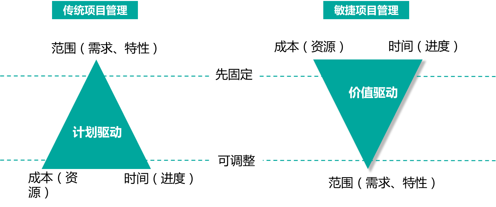
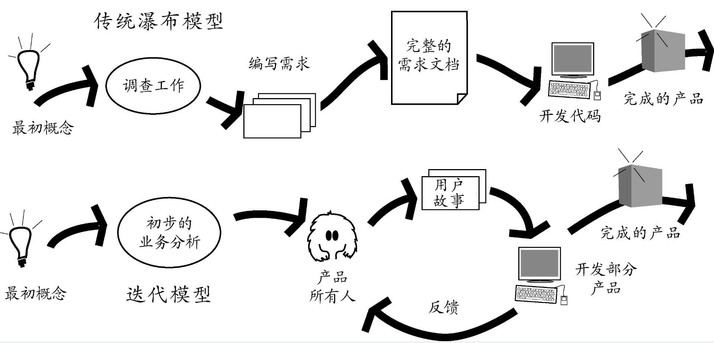
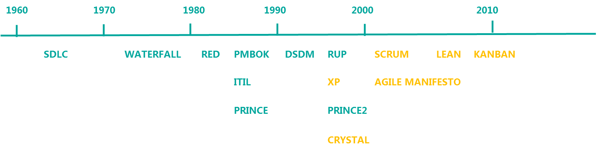

## 为什么要做项目管理

**我们先看一个互联网项目开发过程：**

```
领导：小明，你看这项目新加的需求你一个人大概要多长时间才能完成上线？

小明：需求大概看了下，一个月左右吧

领导：别跟我说“左右”！准确一点，究竟多少天？

小明：那就20个工作日吧

领导：这个功能急需推出抢占市场，20个工作日太长了，给你两周吧。

小明：两周实在太短了，领导

领导：那就3周吧，别再讨价还价了，就这么定了。

小明：好吧
```

**小明接着进入紧张开发中，每天挑个任务处理下：**

```
领导：小明，2周过去了，进展怎么样了

小明：有个模块用到的技术之前没接触过，花了2天时间学习；用户模块逻辑复杂，比预期多话了3天，另外之前组件/操作没封装，重新封装后把之前的都改了一遍

领导：你得抓紧啊，就剩一周了
```

**一边做一边发现，实现需求，要开发的工作还是很多的；一周后：**

```
领导：小明，是否可以测试了？

小明：还不行，我在等其它系统接口，不知道他们什么时候开发完；另外有个模版，产品也没给我

领导：你得催他们啊，另外你得反馈给我😓
```

**加班加点两周后，终于做完了，兴高采烈说可以测试了：**

```
测试：小明需求流程走不通会报错啊，你看下

小明：哦，是测试环境上路径没写对，数据库表也没更新（大写的尴尬），我调整下

测试：小明，这ui还原度不高啊，看起来不协调

小明：哎呀，工期那么紧，我也没办法

测试：这个金额输入框没做校验啊，输个字母就直接蹦了

小明：呃，前端没校验，后端接口也没处理边界情况，导致报错了，错误前端没拦截处理

测试：这个功能逻辑不对吧，开需求会时有特意讲过啊，怎么还做错了；这么多明显的问题，我怎么测试啊...

小明：我改还不行嘛, 好累...
```

这一改4天过去了，项目总工期来到了30个工作日（6周）， 离最初3周相去甚远。

**看完对话是不是似曾相识？这里小明犯了几个问题：**

1. 没有拆分任务进行评估，只是大概看了下，导致评估时间不准
2. 没和领导商量好开发资源
3. 风险意识不足
4. 质量没达到要求
5. 各方沟通不足

**项目管理是互联网人的基础能力：** 在互联网行业中，无论哪个岗位都不是孤立存在的，都无法独自完成项目的闭环，因此必然涉及和人的沟通、对资源的管理、对时间进度的管理。

## 什么是项目管理

**什么是项目？**

PMI(项目管理协会)里介绍，**项目是为了一个特定的目标，组织相关资源，进行的一次临时性的努力，项目结束时交付产品、服务或结果这样的产物，然后解散相关资源。**

**什么是项目管理？**

根据项目的定义，可以把项目管理可以理解为：将知识、技能、工具和技术应用到项目活动中以满足项目要求的过程。

为了实现一个特定目标，所实施的一系列针对项目要素的管理过程，包括过程、手段以及技术等。项目管理的目标是**为了能够预测性的通过对时间、成本以及一定质量的控制去交付成果，所有这些和项目相关的组成构成了项目管理的范围。**

**互联网行业里常说的产品和项目是什么却别？**

一般传统行业，尤其是外包行业，通常都是从事做项目的业务，为了客户完成一个项目。而互联网公司如BAT等，基本都是在做产品，**产品应该最初是从项目发展起来的**，由于满足特定的用户（客户）的需求，通过立项，召集相关资源，把一个产品从无到有的做出来，当项目交付投入市场后，如果市场表现好，就会根据用户的需求不断的迭代优化，就变成了产品化。而产品要不断的迭代更新版本，**每个版本的开发过程其实就可以看成项目**。通过项目管理的方法保证版本保证质量的按期交付，完成产品的版本迭代更新。

## 怎么做项目管理

**项目管理是一门广泛而科学的学科，需要大量的管理知识作为基础。最有名的PMBOK，全称正是《项目管理知识体系指南》，PMBOK是全面介绍了项目管理所涉及的知识，分为五大过程组和十大知识领域：**

```
五大过程组：启动 -> 规划 -> 执行 -> 监控 -> 收尾

十大知识领域：整合管理、范围管理、时间管理、成本管理、质量管理、采购管理、人力资源管理、沟通管理、风险管理、相关方管理
```

其中时间、范围、成本是项目管理的三要素。

项目管理用到的方法有很多，基本来自于项目实践，并跟随历史发展、组织的进步一起成长，这里着重介绍**敏捷项目管理**和**传统项目管理（如：瀑布开发、精益、功能驱动开发等方法）**。

### 敏捷项目管理 VS 传统项目管理

在互联网行业里，敏捷的项目管理方式比较受用，那为什么大家更喜欢敏捷项目管理呢？敏捷项目管理跟传统的项目管理有什么不同和特点呢？我们从价值理念、流程框架、实践方法三个角度来说明下：

#### 价值理念



看上面的图，大家都知道项目管理的三要素：时间、范围、成本。从这三要素上说下两种项目管理方法的不同。

传统的项目管理，是先确定产品的范围，也就是要做哪些需求和特性先固定下来；然后评估这些需求要花费多少时间，协调花费多少人力，然后形成各种计划，如排期计划、沟通计划、人力分配计划、风险计划等等，然后按照既定的计划来推进，是典型的**计划驱动**。因为只有这样，进度和成本才可以估算，风险才可以控制。而敏捷项目管理，是先固定了成本、和时间，如一个团队就10个人，迭代周期两周，那我们先做哪些**有价值**的需求和特性。所以它们本质的区别是，**传统项目管理是`计划驱动`的，而敏捷项目管理是`价值驱动`**。

在互联网大环境下，市场环境是很不确定性的，所以很多业务最开始需求的范围就很难确定下来，或者前期确定下来，后期也会不断的变化。传统项目管理的价值理念是需求范围要确定，最好不变，不适合互联网公司的业务环境，所以敏捷才应用更广泛。

#### 研发模式



传统的项目管理，通常用瀑布的研发模型，瀑布模型是最典型的预见性方法，什么叫预见性方法，就是做之前先严密的分析计划，严格遵守预先计划的需求分析、设计、编码、集成、测试、维护的步骤顺序化进行。为了后期的执行过程中不会有太大的风险和偏差，所以前期会花大块的时间准备繁重的各种文档，并且会有很严格的评审流程。通过预见性的方法来保证有个好的研发过程。这样的研发模型是不接受变更的，因为变更的代价会较大。

而敏捷项目管理，通常用迭代的研发模型，在初步分析后，产品就以小的增量进行开发。先小步快跑起来，然后实现小部分功能找到用户做验证反馈，在一步步的完善产品方案，最终交付完成产品。**迭代的研发模型的好处是，一直围绕这用户变化的需求适应调整，保证最终交互的是用户满意的成果**。

通常这两种研发模型，第一种通常是保证了有一个 **“好过程”**，而第二种通常是有一个 **“好结果”**，而“好过程”不一定等于“好结果”，所以尽量选择能产生好结果的研发模式。

#### 实践方法



上面是项目管理历史中，用到过的项目管理方法，**绿色的部分是传统项目管理用到的实践方法，如waterfall、PMBOK、RUP**；**黄色是行业内比较流行的敏捷方法，如XP、scrum、kanban等**。

-  **XP：** 极限编程，XP是偏工程实践和方法，缺乏对项目管理的指导方法。但它里面提到结对编程，持续集成等很好的实践方法。持续集成的核心就是快速试错，提前发现问题，而不是把问题放到集成之后。 

- **Scurm：** 提供一套基于团队运作的敏捷方法，scrum引入了“backlog”、优先级、迭代例会等；scrum优势是简单，易于使用，所以很多互联网团队都在参考和实践。 

- **KANBAN：** 最初是制造业应用的方法，后来被敏捷相关管理进行改良事件，变成故事板。KANBAN能将现有的管理可视化，透明化，有利于管理工作的有效推进。 


从上面的实践方法来看，**传统项目管理方法更像是计划经济体制，更注重规划和过程把控的方法实践；而敏捷管理方法更像是市场经济体制，更多的是适应环境，小步快跑，灵活变化的方法实践。**

**自我管理**

　　前面讲了这么多，弄得好像项目经理很重要，缺了这个项目经理整个项目就不转了。如果项目经理的手下是固定的，只不过做的项目不一样，那我建议项目经理在完成项目的基础上，一定要考虑这样一个目标：

　　建立一套流程，一套大家都熟悉并且会遵守的流程。这个流程可以保证整个项目组在项目经理不在的情形下，也可以运转得很好。

　　目前项目处在什么阶段，这个阶段大家要做什么，下一个阶段是什么；这个阶段有什么任务要做；每个阶段碰到问题要怎么处理；每种任务或者问题由谁来处理。这些并不是很难学会的东西。项目的成员经历过几次，很容易就可以理解要怎么做。项目经理除了推进项目以外，还要在项目的过程中把流程的思路，解决各种问题的思路教给大家，同时明确每个人的职责，达到项目组可以自我管理的程度。

　　一个可以自我管理的项目组，才是一个稳定高效的项目组。项目经理才可以抽身出来，同时去做一些其他的对部门，对公司同时也对自己有利的事情。


**项目管理是门艺术，它不是项目经理的独角戏而是项目团队的大合唱**

**让他们能够自组织自管理，更加敏捷的把大合唱唱好**
