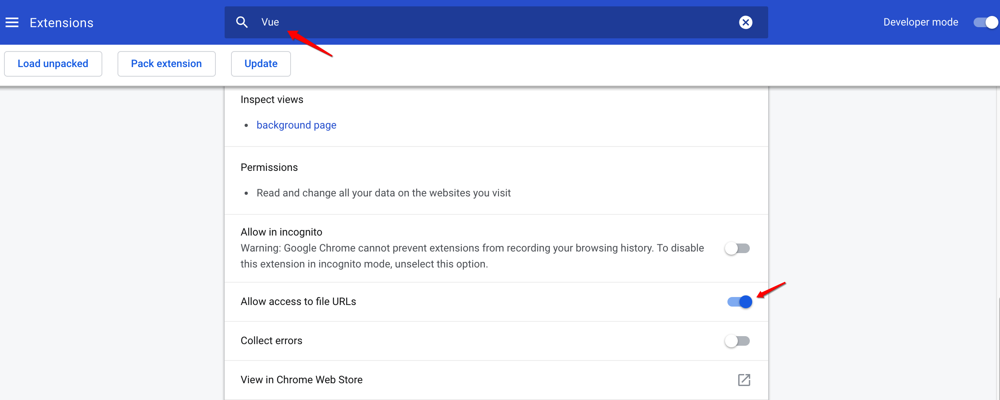
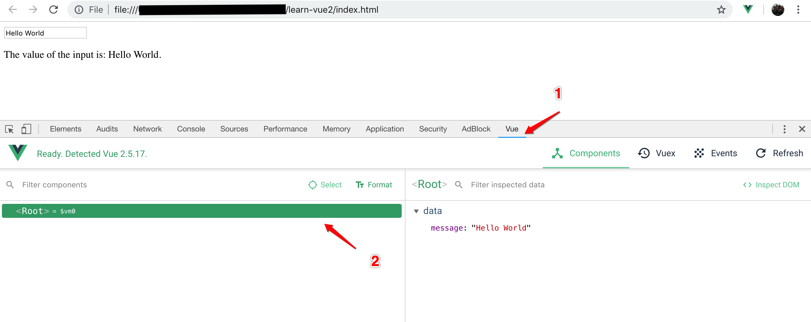

# Vue 概览

阅读完，你会知道Vue特性，懂得在项目中如何使用(小项目和复杂项目component)

## 什么是Vue

Vue是构建用户界面的渐进式框架，自底向上设计。核心库只关注视图层，所以很容易与其他库或现有项目进行集成。


**什么是渐进式？**

**pro‧gres‧sive**
/prə'ɡresiv /
***adjective***

    1. happening or developing gradually or in stages; proceeding step by step
       逐步或分阶段发生或发展; 一步一步地进行

项目的不同阶段可以使用不同的部分，**可增量地采用**。非侵入式，你可以只用它的一部分，而不会因为用了它这一部分就必须用其它所有部分。有时可以把它当成库来用，也可以是框架，也可以用它的全家桶（SFC、Vuex、Router、SSR等）。

比如：

1. 你可以把vue 当成一个js库来使用，就用来收集form表单，和表单验证。
2. 可以把 整个页面的dom 用Vue 来管理，你会发现**关注点由操作dom变成了关注数据的变化，用数据驱动DOM的变化**。
3. 可以用 webpack  + vue-router控制路由。
4. 可以用vuex 处理数据在组件之间的流动，做状态管理。
5. 可以考虑用vue的SSR 做优化。

**参考:**
[vue渐进式概念讨论](https://www.zhihu.com/question/51907207)
[Evan You分享的ppt](https://docs.google.com/presentation/d/1WnYsxRMiNEArT3xz7xXHdKeH1C-jT92VxmptghJb5Es/edit#slide=id.p)

## 安装

1. 直接\<script\>引入，直接下载开发或生产版本并用`<stript>`标签引入，也可以用CDN链接，这时`Vue`会被注册为一个全局变量。
2. NPM安装，在用Vue**构建大型应用**时推荐使用NPM安装。NPM能很好地和诸如[webpack](https://webpack.js.org/)或[Browserify](http://browserify.org/)模块打包器配合使用。同时Vue也提供配套工具(vue-loader)来开发[单文件组件](https://cn.vuejs.org/v2/guide/single-file-components.html)。
3. 命令行工具（CLI），Vue提供了一个vue-cli工具，为单页面应用(SPA)快速搭建繁杂的脚手架(包含vue、webpack及相关插件)。

## 对不同构建版本的解释

在npm包的`dist/`目录里会找到很多不同的 Vue.js 构建版本[详见](https://cn.vuejs.org/v2/guide/installation.html#%E5%AF%B9%E4%B8%8D%E5%90%8C%E6%9E%84%E5%BB%BA%E7%89%88%E6%9C%AC%E7%9A%84%E8%A7%A3%E9%87%8A)

|                            | UMD                | CommonJS              | ES Module          |
| -------------------------- | ------------------ | --------------------- | ------------------ |
| 完成版                     | vue.js             | vue.common.js         | vue.esm.js         |
| 只包含运行时版             | vue.runtime.js     | vue.runtime.common.js | vue.runtime.esm.js |
| 完整版（生产环境）         | vue.min.js         | -                     | -                  |
| 只包含运行时版（生产环境） | vue.runtime.min.js | -                     | -                  |

* 完整版：同时包含`编译器`和`运行时`的版本。
* 编译器：用来将模板字符串编译为JavaScript渲染函数的代码。
* 运行时：基本上是除去编译器的其它一切。
* UMD：UMD版本可以通过`<script>`标签直接用在浏览器中。
* CommonJS：构建工具browserify或webpack1会用到CommonJS版本。
* ES Module：构建工具webpack2+或rollup，会使用ES Module版本（看后面的vue的引入机制分析）。

**参考:**
[项目引入vue的方式](https://segmentfault.com/a/1190000016449418#articleHeader4)
[webpack 里resolve的mainfields](https://webpack.js.org/configuration/resolve/#resolve-mainfields)
[Vue 选项对象中的 el 属性、template属性和 render 渲染函数的关系](https://segmentfault.com/a/1190000008530684)

### 运行时vs完整版(编译器+运行时)

`完整版`是指能够将**template 模板或者从 el 挂载元素(Vue选项对象中的template和el)提取的模板编译成渲染函数**的 Vue 库，而`运行时`构建则是指不能进行模板编译的 Vue 库。

#### 版本选择

什么场合使用独立构建，什么场合使用运行时构建，针对这个问题，只需要考虑清楚在项目中是否使用了模板编译功能。

**按使用方式区分:**

**1. 使用构建工具时**

如果打包时是用vue-loader或vueify，则会将`*.vue`文件内的templates编译成模板渲染函数(js代码)，不需要compiler(编译器)，所以用`运行时`版本编译就可以了。

但如果在创建 Vue 实例（根实例或组件实例）时，模板是从 el 挂载元素提取或template指定的，则需要使用`完整版`构建的 Vue 库，若是使用render函数，则使用`运行时`版本，如下:

*例1:*

```js
//main.js
import Vue from 'vue';

import Example from './Example';

new Vue({
    el: '#root',
    components: {Example}
})

//webpack.config.js
...
module.exports = {
    ...
    resolve: {
        extensions: ['.js', '.vue'],
        alias: {
            'vue$': 'vue/dist/vue.js' // 需要显式的改变引用的包为完整版
        }
    },
    ...
}
```

例1 Vue实例化时，用的是el的outerHTML模板，需要编译成渲染函数才能渲染DOM树，所以需要`完整版`。

*例2：*

```js
import Vue from 'vue';

import Example from './Example';

new Vue({
    el: '#root',
    render: (h) => h(Example)
})
```

例2 Vue实例化时，用的是render渲染函数来渲染DOM树，不需要编译，所以只需要`运行时版`。
> [render函数参考](https://cn.vuejs.org/v2/api/#render)

**2. 不使用构建工具时**

对于在`<script>` 标签引入 Vue.js 的项目，任何实例选项或组件选项中若包含了**template 模板属性 或从 el 挂载元素提取的模板**时，均需要使用`完整版`的 Vue 库。

#### vue的引入机制

使用构建工具进行**模块化开发**时，我们是这么引入vue模块的：

```js
import Vue from 'vue'
```

使用了ES2015的语法，默认将vue的`运行时`作为依赖模块引入程序 （为什么是运行时，看后面分析）。

在命令行(npm or yarn)安装完vue后，可在`node_modules`目录里找到`vue目录`，查看目录下package.json文件，如下示:

```json
{
  ...
  "main": "dist/vue.runtime.common.js",
  "module": "dist/vue.runtime.esm.js",
  "unpkg": "dist/vue.js",
  "typings": "types/index.d.ts",
  "jsdelivr": "dist/vue.js",
  ...
}
```

可以看到vue对多种引入方式以不同文件提供支持，包括`main`对应的符合CommonJS模块规范的`vue.runtime.common.js`、`module`对应的符合ES Module模块规范的`vue.runtime.esm.js`、`unpkg`对应的符合UMD模块规范的`vue.js`以及`typings`对应的支持TypeScript的类型定义文件`index.d.ts`。

当项目使用webpack打包各个模块时，webpack会优先选取ES模块方式引入包 ([webpack处理引入](https://webpack.js.org/configuration/resolve/#resolve-mainfields)、[roolup处理引入](https://www.rollupjs.com/guide/en#faqs))，即使用`vue.runtime.esm.js`，**因为：**

若webpack的target属性值是web时(默认是web)，webpack会依据resolve下的mainFields字段中配置的值所对应的位置读取文件，例如：

```js
// webpack.config.js
module.exports = {
  //...
  resolve: {
    mainFields: ['browser', 'module', 'main'] // 这是默认配置
  }
};
```

webpack首先查找browser对应的vue版本，由于vue的package.json里没提供browser版本，则接着找module对应的版本，若也没提供module，则使用main对应的版本。

>1. 由于JavaScript可以用于服务端和浏览器端，所以webpack提供了多个target属性值(web, webworker, node)，用于打包时做特别处理
>2. mainFields里的`browser`指定该模块供浏览器使用的入口文件、`module`指定一个针对`es6`模块及语法的入口文件、`main`指定默认提供的入口文件

## 挂载点、模板/渲染函数

### el、template和render渲染函数关系

Vue选项对象中的el、template属性、render渲染函数三者之间的关系：

* 当Vue选项对象中有render渲染函数时，Vue构造函数将直接使用渲染函数，渲染DOM树。
* 当Vue选项对象中没有render渲染函数时，Vue构造函数首先通过template模板编译生成渲染函数，然后在再渲染DOM树。
* 当Vue选项对象中既没有render渲染函数，也没有template模板时，会通过el属性获取挂载元素的outerHTML作为模板，编译生成渲染函数。

也就是在进行DOM树的渲染时，render渲染函数的优先级最高，template次之且需要编译成渲染函数，而挂载点el属性对应的元素若存在，则在前两者均不存在时，其outerHTML才会用于编译与渲染。

**构建Vue 实例时，选项对象中 el 属性、template属性和 render 渲染函数是否三者必有其一？**

不一定，可以不使用这三者创建Vue实例，事实上，如果在Vue实例选项中既没有设置el挂载点属性，也没有显式调用$mount方法，是不会触发对render渲染函数（无论是手工编写还是编译生成）的检查的。

比较常见的应用场景是为实现多组件间通信而创建的Event Bus。

创建Event Bus:

```js
// event-bus.js
import Vue from 'vue'
export const EventBus = new Vue()
```

然后就可以根据需要给EventBus添加事件监听：

```js
import EventBus from 'event-bus.js'
EventBus.$on('customEvent', function(...params){
    // ...
})
```

并在需要时出发事件：

```js
import EventBus from 'event-bus.js'
EventBus.$emit('customEvent', ...params)
```

这样可以简单解决非父子组件间通讯的需求。

## 生成环境部署

### 开启生产环境模式

开发环境下，Vue会提供很多警告来帮你对付常见的错误和陷阱。而在生产环境下，这些警告语句却没有用，反而会增加应用的体积。此外，有些警告检查还有一些小的运行开销，这在生产环境模式下是可以避免的。

#### 不使用构建工具

如果用Vue完整版，即直接用`<script>`元素引入Vue而不提前进行构建，请记得在生产环境下使用压缩后的版本(`vue.min.js`)。

#### 使用构建工具

当使用webpack或Browserify类似的构建工具时，Vue源码会根据`process.env.NODE_ENV`决定是否启用生产环境模式，默认情况为开发环境模式。在 webpack 与 Browserify 中都有方法来覆盖此变量，以启用 Vue 的生产环境模式，同时在构建过程中警告语句也会被压缩工具去除。

在webpack 4+中，可以使用`mode`选项开启生产环境模式：

```js
module.exports = {
    mode: 'production'
}
```

## Learn Vue2: Step By Step

### Data Binding

给input赋值，以前是通过如下方式做的，而为了取input值赋给变量，往往需要添加事件监听(blur,  keyup/down)并在回调里面操作，这很繁琐。

```html
//index.html
<!DOCTYPE html>
<html lang="en">
<head>
    <meta charset="UTF-8">
    <meta name="viewport" content="width=device-width, initial-scale=1.0">
    <meta http-equiv="X-UA-Compatible" content="ie=edge">
    <title>Document</title>
</head>
<body>

    <input type="text" id="input">

    <script>
        let data = {
            message: 'Hello World'
        };
        document.querySelector('#input').value = data.message;
    </script>

</body>
</html>
```

我们引入Vue，看下它是怎么做的：

```html
//index.html
<!DOCTYPE html>
<html lang="en">
<head>
    <meta charset="UTF-8">
    <meta name="viewport" content="width=device-width, initial-scale=1.0">
    <meta http-equiv="X-UA-Compatible" content="ie=edge">
    <title>Document</title>
</head>
<body>

    <div id="root">
        <input type="text" id="input" v-model="message">
        <p>The value of the input is: {{ message }}.</p>
    </div>

    <script src="https://cdn.jsdelivr.net/npm/vue@2.5.17/dist/vue.js"></script>

    <script>
        let data = {
            message: 'Hello World'
        };

        new Vue({
            el: '#root',
            data: data
        })
    </script>

</body>
</html>
```

实例化Vue，指定该实例作用范围(el: '#root')，在input上添加`v-model`指令并设置变量message就完成了input取值赋值，而且还是实时的。

### Setup Vue Devtools

在接着讲语法前，先看下vue的调试工具如何使用。

参照文档[安装](https://github.com/vuejs/vue-devtools)，这里需要在文件url（直接在浏览器打开index.html时，是用`file://`协议打开的）下调试，所以扩展（Vue Devtools）要打开对文件url的访问权限，已chrome为例：



打开chrome调试并点击Vue，可查看到vue的根实例，选中改实例，能查看实例属性及计算属性。



修改页面input输入框值，vue调试工具里值也会实时更新，通过调试工具还可以拿到根实例变量，可直接通过实例变量来操作属性及计算属性，本例中根实例变量是`$vm0`，进一步阅读[参考](https://github.com/vuejs/vue-devtools)

### Lists

开发中会经常用到数组，vue提供`v-for`指令来遍历并渲染数组，假设个需求：遍历数组，生成无序列表，并且可通过input输入框+按钮添加数组元素，看下如何实现：

```html
<!DOCTYPE html>
<html lang="en">
<head>
    <meta charset="UTF-8">
    <meta name="viewport" content="width=device-width, initial-scale=1.0">
    <meta http-equiv="X-UA-Compatible" content="ie=edge">
    <title>Document</title>
</head>
<body>

    <div id="root">
        <ul>
            <li v-for='name in names' v-text='name'></li>
        </ul>

        <input id="input">
        <button id="button">Add Name</button>
    </div>

    <script src="https://cdn.jsdelivr.net/npm/vue@2.5.17/dist/vue.js"></script>

    <script>

        var app = new Vue({
            el: '#root',
            data: {
                names: ['Foo', 'Bar', 'Zoo']
            }
        });

       document.querySelector('#button').addEventListener('click', ()=>{
            let name = document.querySelector('#input');
            app.names.push(name.value);
            name.value = '';
        });

    </script>

</body>
</html>
```

这里通过DOM事件监听来实现，不过最好能把代码整合到Vue里便于维护，可通过vue生命周期钩子`mounted`实现：

```html
<!DOCTYPE html>
<html lang="en">
<head>
    <meta charset="UTF-8">
    <meta name="viewport" content="width=device-width, initial-scale=1.0">
    <meta http-equiv="X-UA-Compatible" content="ie=edge">
    <title>Document</title>
</head>
<body>

    <div id="root">
        <ul>
            <li v-for='name in names' v-text='name'></li>
        </ul>

        <input id="input">
        <button id="button">Add Name</button>
    </div>

    <script src="https://cdn.jsdelivr.net/npm/vue@2.5.17/dist/vue.js"></script>

    <script>

        var app = new Vue({
            el: '#root',
            data: {
                names: ['Foo', 'Bar', 'Zoo']
            },
            mounted (){
                document.querySelector('#button')
                        .addEventListener('click', () => {
                            let name = document.querySelector('#input');
                            app.names.push(name.value);
                            name.value = '';
                        });
            }
        });

    </script>

</body>
</html>
```

通过DOM事件来实现，不够优雅，Vue提供了更好的事件处理，看下节

### Vue Event Listeners

Vue提供了`v-on`指令用来注册事件监听，接着上节，看下如何改进:

```html
<!DOCTYPE html>
<html lang="en">
<head>
    <meta charset="UTF-8">
    <meta name="viewport" content="width=device-width, initial-scale=1.0">
    <meta http-equiv="X-UA-Compatible" content="ie=edge">
    <title>Document</title>
</head>
<body>

    <div id="root">
        <ul>
            <li v-for='name in names' v-text='name'></li>
        </ul>

        <input type="text" v-model="newName">
        <button v-on:click="addName">Add Name</button>
    </div>

    <script src="https://cdn.jsdelivr.net/npm/vue@2.5.17/dist/vue.js"></script>

    <script>

        var app = new Vue({
            el: '#root',
            data: {
                newName: '',
                names: ['Foo', 'Bar', 'Zoo']
            },
            methods: {
                addName(){
                    this.names.push(this.newName);
                    this.newName = '';
                }
            },
        });

    </script>

</body>
</html>
```

1. input输入框添加变量绑定:` v-model="newName"`，newName变量需要在data选项里定义
2. 按钮上添加了`v-on:click`事件（也可以用缩写`@click`），并指定事件处理函数addName(需要在methods选项里定义)
3. addName函数通过this访问data选项里的数据，从而实现添加

[进一步了解参考](https://cn.vuejs.org/v2/guide/events.html)

### Attribute and Class Binding

通常，html 属性值是直接写在html里的，也可以写在js中，我们看下vue如何实现：

```html
<!DOCTYPE html>
<html lang="en">
<head>
    <meta charset="UTF-8">
    <meta name="viewport" content="width=device-width, initial-scale=1.0">
    <meta http-equiv="X-UA-Compatible" content="ie=edge">
    <title>Document</title>

    <style>
        .is-loading {
            background: red;
        }
    </style>

</head>
<body>

    <div id="root">

        <button v-bind:title="title"> Hover Over Me</button>

        <button v-bind:class="{'is-loading': isLoading}" @click="toggleClass">Toggle Me</button>
    </div>

    <script src="https://cdn.jsdelivr.net/npm/vue@2.5.17/dist/vue.js"></script>

    <script>

        var app = new Vue({
            el: '#root',
            data: {
                isLoading: false,
                title: 'The title is being set through JavaScript'
            },
            methods: {
                toggleClass(){
                    this.isLoading = true;
                }
            }
        });

    </script>

</body>
</html>
```

1. 第一个button绑定了title属性，通过在data选项里添加title变量设定属性值
2. 第二个button绑定了class属性，并添加事件触发

### Computed Properties

开发时，经常会碰到数据需要计算才能渲染到页面里的情况，看下vue如何做的：

例1：message变量值需要反转后输出到页面。

```html
<!DOCTYPE html>
<html lang="en">
<head>
    <meta charset="UTF-8">
    <meta name="viewport" content="width=device-width, initial-scale=1.0">
    <meta http-equiv="X-UA-Compatible" content="ie=edge">
    <title>Document</title>
</head>
<body>

    <div id="root">

        <h1>{{ reverseMessage }}</h1>

    </div>

    <script src="https://cdn.jsdelivr.net/npm/vue@2.5.17/dist/vue.js"></script>

    <script>

        var app = new Vue({
            el: '#root',
            data: {
                message: 'Hello World!'
            },
            computed: {
                reverseMessage(){
                    return this.message.split('').reverse().join('');
                }
            }
        });

    </script>

</body>
</html>
```

例2：控制tasks列表，显示已完成的任务列表，可以打开console，通过app.tasks[0].completed = false来验证计算属性更新

```html
<!DOCTYPE html>
<html lang="en">
<head>
    <meta charset="UTF-8">
    <meta name="viewport" content="width=device-width, initial-scale=1.0">
    <meta http-equiv="X-UA-Compatible" content="ie=edge">
    <title>Document</title>
</head>
<body>

    <div id="root">

        <h2>All Tasks</h2>
        <ul>
            <li v-for='task in tasks' v-text='task.description'></li>
        </ul>

        <h2>Incompeleted Tasks</h2>
        <ul>
            <li v-for='task in incompletedTask' v-text='task.description'></li>
        </ul>

    </div>

    <script src="https://cdn.jsdelivr.net/npm/vue@2.5.17/dist/vue.js"></script>

    <script>

        var app = new Vue({
            el: '#root',
            data: {
                tasks: [
                    { description: 'des1', completed: true },
                    { description: 'des2', completed: false },
                    { description: 'des3', completed: false },
                    { description: 'des4', completed: false },
                    { description: 'des5', completed: false },
                    { description: 'des6', completed: true },
                ]
            },
            computed: {
                incompletedTask(){
                    return this.tasks.filter(task=>  !task.completed)
                }
            }

        });

    </script>

</body>
</html>
```

### Components

组件是可复用的 Vue 实例，且带有一个名字；看下vue如何使用组件:

```html
//index.html
<!DOCTYPE html>
<html lang="en">
<head>
    <meta charset="UTF-8">
    <meta name="viewport" content="width=device-width, initial-scale=1.0">
    <meta http-equiv="X-UA-Compatible" content="ie=edge">
    <title>Document</title>
</head>
<body>

    <div id="root">
        <task>Go to store</task>
        <task>Go to bank</task>
        <task>Go to work</task>
    </div>

    <script src="https://cdn.jsdelivr.net/npm/vue@2.5.17/dist/vue.js"></script>

    <script src="main.js"></script>

</body>
</html>
```

```js
//main.js
Vue.component('task', {
    template: '<li><slot></slot></li>'
});

new Vue({
    el: '#root'
});
```

以上实例，创建了一个全局组件`task`，通过`<task></task>`标签形式在html里使用

### Components Within Components

上节创建了单个组件，但vue里组件也可以由其它组件组成；以上节例子为例：

```html
//index.html
<!DOCTYPE html>
<html lang="en">
<head>
    <meta charset="UTF-8">
    <meta name="viewport" content="width=device-width, initial-scale=1.0">
    <meta http-equiv="X-UA-Compatible" content="ie=edge">
    <title>Document</title>
</head>
<body>

    <div id="root">

        <task-list></task-list>

    </div>

    <script src="https://cdn.jsdelivr.net/npm/vue@2.5.17/dist/vue.js"></script>

    <script src="main.js"></script>

</body>
</html>
```

```js
//main.js
Vue.component('task-list', {
    template: `<ul>
       <task v-for="task in tasks" :key="task.id">{{ task.task }}</task>
    </ul>`,
    data(){
        return {
            tasks: [
                { id: 1, task: 'Go to store', completed: true },
                { id: 2, task: 'Go to bank', completed: false },
                { id: 3, task: 'Go to work', completed: false },
            ]
        }
    }
});

Vue.component('task', {
    template: '<li><slot></slot></li>'
});

new Vue({
    el: '#root'
});
```

### 实用组件Exercise #1: Message

项目中往往会用到消息，这节实现message组件 (使用[bulma](https://bulma.io/documentation/components/message/)样式)，并添加关闭操作:

```html
//index.html
<!DOCTYPE html>
<html lang="en">
<head>
    <meta charset="UTF-8">
    <meta name="viewport" content="width=device-width, initial-scale=1.0">
    <meta http-equiv="X-UA-Compatible" content="ie=edge">
    <title>Document</title>

    <link rel="stylesheet" href="https://cdnjs.cloudflare.com/ajax/libs/bulma/0.7.2/css/bulma.css">
    <style>
        body{
            padding-top: 40px;
        }
    </style>
</head>
<body>

    <div id="root" class="container">

        <message title="Hello World" body="Lorem ipsum dolor sit amet"></message>

        <message title="Hello Everyone" body="Lorem ipsum dolor sit amet"></message>

    </div>

    <script src="https://cdn.jsdelivr.net/npm/vue@2.5.17/dist/vue.js"></script>

    <script src="main.js"></script>

</body>
</html>
```

```js
//main.js
Vue.component('message', {
    data() {
        return {
            isVisible: true
        }
    },
    props: ['title', 'body'],
    template: `
    <article class="message" v-show="isVisible">
        <div class="message-header">
            {{ title }}
            <button class="delete" @click="isVisible = false"></button>
        </div>
        <div class="message-body">
            {{ body }}
        </div>
    </article>
    `
})

new Vue({
    el: '#root'
});
```

### 实用组件Exercise #2: Modal

实现modal组件 (使用[bulma](https://bulma.io/documentation/components/modal/)样式): 通过点击按钮，显示modal (使用组件通信）。

```html
//index.html
<!DOCTYPE html>
<html lang="en">
<head>
    <meta charset="UTF-8">
    <meta name="viewport" content="width=device-width, initial-scale=1.0">
    <meta http-equiv="X-UA-Compatible" content="ie=edge">
    <title>Document</title>

    <link rel="stylesheet" href="https://cdnjs.cloudflare.com/ajax/libs/bulma/0.7.2/css/bulma.css">
    <style>
        body{
            padding-top: 40px;
        }
    </style>
</head>
<body>

    <div id="root" class="container">

        <button @click="showModal = true">Toggle a modal</button>

        <modal v-show="showModal" @close="showModal = false">
            Lorem ipsum dolor sit amet
        </modal>

    </div>

    <script src="https://cdn.jsdelivr.net/npm/vue@2.5.17/dist/vue.js"></script>

    <script src="main.js"></script>

</body>
</html>
```

```js
//main.js
Vue.component('modal', {
    template: `
    <div class="modal is-active">
        <div class="modal-background"></div>
        <div class="modal-content">
            <div class="box">
                <slot></slot>
            </div>
        </div>
        <button class="modal-close is-large" @click="$emit('close')"></button>
    </div>
    `,
})

new Vue({
    el: '#root',
    data: {
        showModal: false
    }
});
```

### 实用组件Exercise #3: Tabs

定义一个tabs组件 (使用[bulma](https://bulma.io/documentation/components/tabs/)样式)，该组件由多个子组件tab构成，并根据提供的子组件，动态生成tab标签：
1. 首先定义tabs组件，添加template(从bulma上获取)并添加slot存放子组件，为了根据提供的子组件来渲染tabs，我们需要获取子组件，所以需要定义tab组件，此时父组件`this.$children`就能获取子组件了。
2. tabs需要添加切换选中交互
3. 切换选中交互时，需要控制字组件显示

```html
//index.html
<!DOCTYPE html>
<html lang="en">
<head>
    <meta charset="UTF-8">
    <meta name="viewport" content="width=device-width, initial-scale=1.0">
    <meta http-equiv="X-UA-Compatible" content="ie=edge">
    <title>Document</title>

    <link rel="stylesheet" href="https://cdnjs.cloudflare.com/ajax/libs/bulma/0.7.2/css/bulma.css">
    <style>
        body{padding-top: 40px;}
    </style>
</head>
<body>

  <div id="root" class="container">

    <tabs>
        <tab name="About Us" :selected="true">
            <h1>Here is the content for the about us tab.</h1>
        </tab>

        <tab name="About Our Culture">
            <h1>Here is the content for the about our culture tab.</h1>
        </tab>

        <tab name="About Our Vision">
            <h1>Here is the content for the about our vision tab.</h1>
        </tab>
    </tabs>

  </div>

  <script src="https://cdn.jsdelivr.net/npm/vue@2.5.17/dist/vue.js"></script>

  <script src="main.js"></script>

</body>
</html>

```

```js
//main.js
Vue.component('tabs', {
    template: `
        <div>
            <div class="tabs">
                <ul>
                    <li v-for="tab in tabs" :class="{'is-active': tab.isActive}">
                        <a :href="tab.href" @click="selectTab(tab)">{{ tab.name }}</a>
                    </li>
                </ul>
            </div>

            <div class="tabs-details">
                <slot></slot>
            </div>
        </div>
    `,
    data(){
        return {
            tabs: []
        }
    },
    mounted(){
        this.tabs = this.$children;
    },
    methods: {
        selectTab(selectedTab){
            this.tabs.forEach(tab=>{
                tab.isActive = (tab.name === selectedTab.name)
            })
        }
    }
})

Vue.component('tab', {
    props: {
        name: {required: true},
        selected: {default: false}
    },
    template: `
        <div v-show="isActive"><slot></slot></div>
    `,
    data(){
        return {
            isActive: false
        }
    },
    mounted(){
        this.isActive = this.selected;
    },
    computed: {
        href(){
            return '#'+this.name.toLowerCase().replace(/ /g, '-');
        }
    }
})

new Vue({
    el: '#root'
});
```

这里通过vue实例属性`vm.$children`，获取当前组件(tabs)实例的直接子组件(tab)。**需要注意`$children`并不保证顺序，也不是响应式的**，可以考虑用`$slot`

### Component Communication Example #1: Custom Events

父子组件间通信，通过自定义事件来处理

```html
//index.html
<!DOCTYPE html>
<html lang="en">
<head>
    <meta charset="UTF-8">
    <meta name="viewport" content="width=device-width, initial-scale=1.0">
    <meta http-equiv="X-UA-Compatible" content="ie=edge">
    <title>Document</title>

    <link rel="stylesheet" href="https://cdnjs.cloudflare.com/ajax/libs/bulma/0.7.2/css/bulma.css">
    <style>
        body{
            padding-top: 40px;
        }
    </style>
</head>
<body>

    <div id="root" class="container">

        <coupon @applied="onCouponApplied"></coupon>

    </div>

    <script src="https://cdn.jsdelivr.net/npm/vue@2.5.17/dist/vue.js"></script>

    <script src="main.js"></script>

</body>
</html>
```

```js
//main.js
Vue.component('coupon', {
    template: `<input placeholder="Enter your coupon code" @blur="onCouponApplied">`,
    methods: {
        onCouponApplied(){
            this.$emit('applied')
        }
    }
})

new Vue({
    el: '#root',
    methods: {
        onCouponApplied(){
            alert('It was applied!');
        }
    }
});
```

### Component Communication Example #2: Event Dispatcher

上节讲了父子组件间通信，非父子组件通信可使用事件调度器:

```html
//index.html
<!DOCTYPE html>
<html lang="en">
<head>
    <meta charset="UTF-8">
    <meta name="viewport" content="width=device-width, initial-scale=1.0">
    <meta http-equiv="X-UA-Compatible" content="ie=edge">
    <title>Document</title>

    <link rel="stylesheet" href="https://cdnjs.cloudflare.com/ajax/libs/bulma/0.7.2/css/bulma.css">
    <style>
        body{
            padding-top: 40px;
        }
    </style>
</head>
<body>

    <div id="root" class="container">

        <coupon></coupon>

    </div>

    <script src="https://cdn.jsdelivr.net/npm/vue@2.5.17/dist/vue.js"></script>

    <script src="main.js"></script>

</body>
</html>
```

```js
//main.js
window.Event = new Vue();

Vue.component('coupon', {
    template: `<input placeholder="Enter your coupon code" @blur="onCouponApplied">`,
    methods: {
        onCouponApplied(){
            Event.$emit('applied')
        }
    }
})

new Vue({
    el: '#root',
    methods: {
        onCouponApplied(){
            alert('It was applied!');
        }
    },
    created() {
        Event.$on('applied', this.onCouponApplied);
    }
});
```

或使用es2015类改写

```js
//main.js
window.Event = new class{
    constructor(){
        this.vue = new Vue();
    }

    fire(event, data=null){
        this.vue.$emit(event, data);
    }

    listen(event, callback){
        this.vue.$on(event, callback);
    }
};

Vue.component('coupon', {
    template: `<input placeholder="Enter your coupon code" @blur="onCouponApplied">`,
    methods: {
        onCouponApplied(){
            Event.fire('applied')
        }
    }
})

new Vue({
    el: '#root',
    methods: {
        onCouponApplied(){
            alert('It was applied!');
        }
    },
    created() {
        Event.listen('applied', this.onCouponApplied);
    }
});
```

### Named Slots (具名插槽)

截止目前，我们都是用默认插槽，也就是说它会把所有组件内的内容都输出到插槽中；有时候可能需要更多空，例如，一个假设的 `<base-layout>` 组件的模板如下:

```html
<div class="container">
  <header>
    <!-- 我们希望把页头放这里 -->
  </header>
  <main>
    <!-- 我们希望把主要内容放这里 -->
  </main>
  <footer>
    <!-- 我们希望把页脚放这里 -->
  </footer>
</div>
```

对于这样的情况，`<slot>` 元素有一个特殊的特性：name。这个特性可以用来定义额外的插槽：
```html
<div class="container">
  <header>
    <slot name="header"></slot>
  </header>
  <main>
    <slot></slot>
  </main>
  <footer>
    <slot name="footer"></slot>
  </footer>
</div>
```

以modal框（带有header、content、footer）为例 (使用[bulma](https://bulma.io/documentation/components/modal/)样式)，需要header插槽、footer插槽:
```html
//index.html
<!DOCTYPE html>
<html lang="en">
<head>
    <meta charset="UTF-8">
    <meta name="viewport" content="width=device-width, initial-scale=1.0">
    <meta http-equiv="X-UA-Compatible" content="ie=edge">
    <title>Document</title>

    <link rel="stylesheet" href="https://cdnjs.cloudflare.com/ajax/libs/bulma/0.7.2/css/bulma.css">
    <style>
        body{
            padding-top: 40px;
        }
    </style>
</head>
<body>

    <div id="root" class="container">
        <modal>
            <template slot="header">My Title</template>
            Content here.
            <div slot="footer">
                <button class="button is-success">Save changes</button>
                <button class="button">Cancel</button>
            </div>
        </modal>
    </div>

    <script src="https://cdn.jsdelivr.net/npm/vue@2.5.17/dist/vue.js"></script>

    <script src="main.js"></script>

</body>
</html>
```

```js
//main.js
Vue.component('modal', {
    template: `
    <div class="modal is-active">
        <div class="modal-background"></div>
        <div class="modal-card">
            <header class="modal-card-head">
                <p class="modal-card-title">

                    <slot name="header"></slot>

                </p>
                <button class="delete" aria-label="close"></button>
            </header>
            <section class="modal-card-body">

                <slot>
                    Default content here.
                </slot>

            </section>
            <footer class="modal-card-foot">

                <slot name="footer"></slot>

            </footer>
        </div>
    </div>
    `,
})
new Vue({
    el: '#root'
});
```

### Single-Use Components and Inline Templates

在定义组件时，不一定要指定`template`属性和`render`函数，可以在组件上添加`inline-template`特性，这时组件将会使用其里面的内容作为模板，而不是将其作为被分发的内容。例如：

```html
//index.html
<!DOCTYPE html>
<html lang="en">
<head>
    <meta charset="UTF-8">
    <meta name="viewport" content="width=device-width, initial-scale=1.0">
    <meta http-equiv="X-UA-Compatible" content="ie=edge">
    <title>Document</title>

    <link rel="stylesheet" href="https://cdnjs.cloudflare.com/ajax/libs/bulma/0.7.2/css/bulma.css">
    <style>
        body{
            padding-top: 40px;
        }
    </style>
</head>
<body>

    <div id="root" class="container">
        <progress-view inline-template>
            <div>
                <h1>Your Progress Through This Course Is {{ completionRate }}%</h1>
                <p><button @click="completionRate += 10">Update Completion Rate</button></p>
            </div>
        </progress-view>
    </div>

    <script src="https://cdn.jsdelivr.net/npm/vue@2.5.17/dist/vue.js"></script>

    <script src="main.js"></script>

</body>
</html>
```

```js
//main.js
Vue.component('progress-view', {
    data(){
        return {
            completionRate: 0
        }
    }
})

new Vue({
    el: '#root'
});
```


