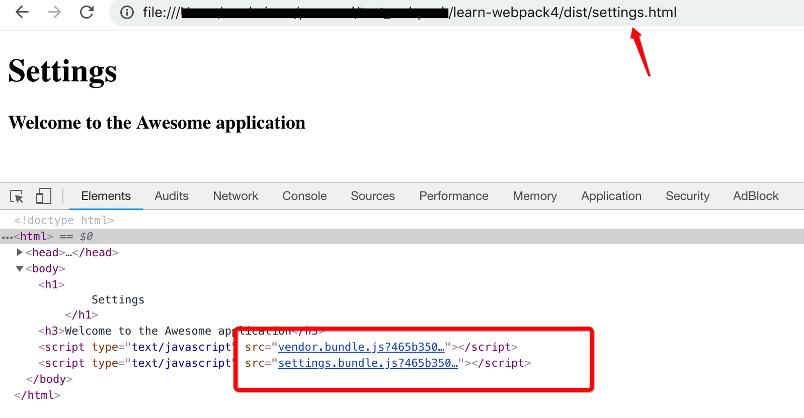

## Webpack是什么

Webpack是模块打包器，它可以处理CommonJS、AMD以及ES6模块系统；Webpack有一些灵活、酷炫的功能特性, 如:

* **代码分离**：可以把多个模块所引用到的代码打包到一个文件，即抽取公共代码并打包至单独的文件里
* **加载器**(loader)：有了loader，你可以在js中加载各种类型文件
* **插件**(plugin)：可让你定制打包操作

## 使用教程

先看本教程最终webpack配置，看不懂没关系，教程会一步步说明每个配置

```js
const path = require('path');
const HtmlWebpackPlugin = require('html-webpack-plugin');
const variables = require('./variables.js');
const package = require('./package.json');
const webpack = require('webpack');
const MiniCssExtractPlugin = require('mini-css-extract-plugin');
const CopyWebpackPlugin = require('copy-webpack-plugin');
const devMode = process.env.NODE_ENV != 'production';

module.exports = {
    mode: 'development',
    // watch: true,
    entry: {
        app: './src/index.js',
        vendor: Object.keys(package.dependencies),
        settings: './src/settings.js'
    },
    output: {
        filename: '[name].bundle.js',
        path: path.resolve(__dirname, 'dist')
    },
    resolve: {
        extensions: ['.js', '.ts'],
    },
    module: {
        rules: [
            // {test: /\.(s*)css$/, use: ['style-loader', 'css-loader', 'sass-loader']}
            {
                test: /\.(sc|c)ss$/,
                use: [
                    devMode ? 'style-loader' : MiniCssExtractPlugin.loader,
                    'css-loader',
                    'sass-loader'
                ]
            },
            {
                test: /\.(png|jp(e*)g|svg)$/,
                use:[{
                    loader: 'url-loader',
                    options: {
                        limit: 80000,
                        name: 'images/[hash]-[name].[ext]'
                    }
                }]
            }
        ]
    },
    devServer: {
        hot: true,
        contentBase: './dist',
        port: 8100
    },
    plugins: [
        new HtmlWebpackPlugin({
            template: 'index.html',
            filename: 'index.html',
            hash: true,
            title: 'HTML Webpack Plugin',
            favWord: variables.word,
            chunks: ['vendor', 'commons', 'app'],
        }),
        new HtmlWebpackPlugin({
            template: 'index.html',
            filename: 'settings.html',
            hash: true,
            title: 'settings',
            favWord: variables.word,
            chunks: ['vendor', 'commons', 'settings'],
        }),
        new webpack.HotModuleReplacementPlugin(),
        new MiniCssExtractPlugin({
            filename:  '[name].css',
            chunkFilename: '[id].css',
        }),
        new CopyWebpackPlugin([
            {from: 'src/images', to: 'images'}
        ])
    ],
    optimization: {
        splitChunks: {
            cacheGroups:{
                commons:{
                    name: 'commons',
                    chunks: 'initial',
                    minChunks: 2,
                    minSize: 0
                }
            }
        },
    }
};
```

### 用npm初始化项目

我们先配置基本的目录结构:

1. 新建项目文件夹，并用npm初始化

    ```js
    mkdir learn-webpack4 && cd learn-webpack4
    npm init -y
    ```

2. 新建src文件夹及子文件夹scripts，并添加app.js文件

    ```js
    mkdir -p src/scripts && touch src/scripts/app.js
    ```

    

3. 编辑app.js，添加如下代码

    ```js
    console.log('Welcome from app.js');
    ```

### 安装webpack

有两个可选项：

1. 全局安装:

    ```js
    npm install -g webpack
    ```

    全局安装的话，我们可以直接在终端使用`webpack`命令

2. 在项目里安装:

    ```js
    npm install webpack webpack-cli --save-dev
    ```

    项目里安装的话，要通过`npm script`来运行`webpack`命令

### webpack执行

有两种方式可选：

1. 使用`webpack`命令

    如果你是全局安装webpack，你可以直接在终端上执行，打包你的应用

    ```js
    webpack ./src/scripts/app.js --output ./dist/app.bundle.js
    ```

    上面命令有2个参数：

    `./src/scripts/app.js`是引用的入口文件，webpack从这文件分析模块依赖树，然后把依赖模块打包到单个输出文件里
    `./dist/app.bundle.js`是最终打包生成的文件，你所有的js代码和其它依赖模块都在里面

2. 使用npm script

    如果你是本地安装(项目里)，可以用这个方式

    在本教程里我们会使用这种方式运行webpack

    在`package.json`文件中的script部分，定义一个脚本 - `start`，如下:

    ```json
    {
        "name": "learn-webpack4",
        "version": "1.0.0",
        "description": "",
        "main": "index.js",
        "scripts": {
            "start": "webpack ./src/scripts/app.js --output ./dist/app.bundle.js"
        },
        "keywords": [],
        "author": "",
        "license": "ISC",
        "devDependencies": {
            "webpack": "^4.22.0"
        }
    }
    ```

    现在我们可以在终端上运行这个脚本:

    ```js
    npm start
    ```

    这个命令会调用项目里安装的webpack命令，打包`app.j`s相关的(包括依赖)代码，并创建`app.bundle.js`文件和dist文件夹


### Webpack配置文件

Webpack有需要命令可选项可以用来配置模块打包及任务执行；我们可以在命令行上指定，也可以写入到专门的配置文件里`webpack.config.js`

这个配置文件采用CommonJS模块语法，导出一个配置对象

1. 在项目根目录webpack文件夹及配置文件--webpack.config.js
2. 我们把上节`webpack ./src/scripts/app.js --output ./dist/app.bundle.js` 的两个参数放到配置里，即entry point和output file

    ```js
    module.exports = {
        mode: 'development',
        entry: './src/scripts/app.js', // 使用的是相对路径
        output: {
            filename: 'app.bundle.js'
        }
    }
    ```

    修改`package.json`配置文件

    ```json
    {
    ...
    "scripts": {
        "start": "webpack --config webpack/webpack.config.js"
    },
    ...
    }
    ```

3. 删除dist目录，执行`npm start`命令

    ```js
    npm start
    ```

    执行命令后，会有先的dist文件夹及app.bundle.js文件生成

    >[publicPath属性](https://juejin.im/post/5ae9ae5e518825672f19b094)

### 生成index.html

我们已经有打包后的`app.bundle.js`文件，现在要把它引入index.html中

我们可以手动添加index.html 或 使用`html-webpack-plugin`自动生成

1. 手动创建index.html
    在dist目录里，创建index.html，如下:

    ```html
    <!DOCTYPE html>
    <html>
    <head>
        <meta charset="UTF-8">
        <title>My Awesome application</title>
    </head>

    <body>
        <h1>Hello World</h1>

        <h3>Welcome to the Awesome application</h3>

        <script src='app.bundle.js'></script>

    </body>
    </html>
    ```

    在浏览器中打开index.html，可查看app.bundle.js代码运行了
    

2. 使用html-webpack-plugin插件生成

    手动创建index.html看起来还不错，如果webpack能自动创建index.html并且插入打包生成的js文件就更好了

    webpack使用html-webpack-plugin插件可以做到这一点，而且插件还有其它特性，如给插入的js文件自动添加hash

    我们看下如何配置这个插件:

    2.1 首先删除dist下的index.html

    2.2 安装插件

    ```js
    npm install html-webpack-plugin --save-dev
    ```

    2.3 在`webpack.config.js`里配置插件：

    ```js
    var HtmlWebpackPlugin = require('html-webpack-plugin');

    module.exports = {
        mode: 'development',
        entry: './src/scripts/app.js', // 使用的是相对路径
        output: {
            filename: 'app.bundle.js'
        },
        plugins: [
            new HtmlWebpackPlugin({
                hash: true,
                filename: 'index.html'
            })
        ]
    }
    ```

    2.4 重新执行npm start 命令

    ```js
    npm start
    ```

    2.5 在dist目录里会生成index.html文件，并且文件里的app.bundle.js带了hash字串

    

    2.6 在浏览器中打开index.html，页面是空白的


#### 插件使用模板生成index.html

除了自动生成index.html外，我们可以创建模板，配置插件使用模板来生成index.html，我们可以在模板里先设置好标题、欢迎信息等等

来看下如何配置：

1. 在src目录里创建index.html模板文件，并添加如下内容：

    ```html
    <!DOCTYPE html>
    <html>
    <head>
        <meta charset="UTF-8">
        <title><%= htmlWebpackPlugin.options.title %></title>
    </head>

    <body>
        <h1> <%= htmlWebpackPlugin.options.myPageHeader %> </h1>
        <h3>Welcome to the Awesome application</h3>
    </body>
    </html>
    ```

    你可能注意到了`<%= htmlWebpackPlugin.options.title %>`和`<%= htmlWebpackPlugin.options.myPageHeader %>`，我们需要在配置插件可选项时提供title和myPageHeader

2. 更新`webpack.config.js`中的HtmlWebpackPlugin配置，使用template属性，如下：

    ```js
        ...
        plugins: [
            new HtmlWebpackPlugin({
                hash: true,
                title: 'My Awesome application',
                myPageHeader: 'Hello World',
                template: './src/index.html',
                filename: 'index.html'
            })
        ]
        ...
    ```

3. 重新运行`npm start`

    ```js
    npm start
    ```

4. 可以在dist目录里查看到index.html，并且带有title和myPageHeader值
    

5. 在浏览器中打开index.html
    

### watch模式

当watch模式开启时，对应用代码做变更(webpack.config.js的变更除外)，这时webpack会重新打包代码

1. 我们只需要在配置里添加watch属性：

    ```js
    var HtmlWebpackPlugin = require('html-webpack-plugin');

    module.exports = {
        mode: 'development',
        entry: './src/scripts/app.js', // 使用的是相对路径
        output: {
            filename: 'app.bundle.js'
        },
        watch: true,
        plugins: [
            new HtmlWebpackPlugin({
                hash: true,
                title: 'My Awesome application',
                myPageHeader: 'Hello World',
                template: './src/index.html',
                filename: 'index.html'
            })
        ]
    }
    ```

2. 重新运行`npm start`

    ```js
    npm start
    ```

3. 在浏览器打开dist/index.html，并修改app.js里console.log输出的内容，刷新页面查看变化
    

### 打包模块依赖

我们接着来看下，webpack如何打包依赖的js模块，创建`my-helper-module.js`文件并在`app.js`中导入(引用)

1. 在`./src/scripts`目录·里，新建`my-helper-module.js`文件，并添加如下代码

    ```js
    export default {
        greetings: 'Hello from my-helper-module!'
    }
    ```

2. 在`app.js`中导入，代码更新如下：

    ```js
    import helperModule from './my-helper-module.js'

    console.log('Welcome from app.js !');
    console.log(helperModule.greetings);
    ```

3. 保存app.js，由于我们开启了`watch: true`模式，所以不需要重新运行`npm start`，webpack会重新打包，我们只需要刷新浏览器
    

我们可以看到，依赖的模块也被打包进`app.bundle.js`了

### 解析文件扩展

上节，我们再`app.js`文件中导入了my-helper-module模块，并指定了模块文件后缀名：

```js
import helperModule from './my-helper-module.js'
```

如何消除导入时的后缀名？我们可以在webpack配置里添加解析扩展配置，让webpack去推算出正确类型

1. 在`webpack.config.js`配置里添加`resolve`属性：

    ```js
        ...
        watch: true,
        resolve: {
            extensions: [".js", ".ts"]
        },
        ...
    ```

2. 修改`app.js`中的引用

    ```js
    import helperModule from './my-helper-module'
    ```

3. 修改webpack配置时，需要重新运行`npm start`

    > 注意：extensions有默认值 ['.wasm', '.mjs', '.js', '.json']，当在配置里指定了extensions，则会覆盖默认值

### 多入口文件

有时你可能想把代码打包成多个文件，例如，打包生成2个文件`app.bundle.js`和`vendor.bundle.js`，前者保存所有应用代码，后者保存npm依赖代码，同时在index.html里能直接插入这两个文件

我们来配置下:
​

1. 添加`lodash`作为应用依赖

    ```js
    npm install lodash --save
    ```

2. 在`app.js`中使用`lodash`，更新代码如下：

    ```js
    import helperModule from './my-helper-module';
    import * as _ from 'lodash';

    console.log('Welcome from app.js !');
    console.log(helperModule.greetings);

    var arr = [1, 2, 3];
    _.each(arr, function(val) {
        console.log('Output from Lodash _.each for Element '+val);
    })
    ```

3. 更新`webpack.config.js`配置：

    ```js
    var HtmlWebpackPlugin = require('html-webpack-plugin');
    var package = require('../package.json');

    module.exports = {
        mode: 'development',
        entry: {
            app: './src/scripts/app.js', // 使用的是相对路径
            vendor: Object.keys(package.dependencies)
        },
        output: {
            filename: '[name].bundle.js'
        },
        ...
    }
    ```

    > a. 我们引入了package.json

    > b. 然后把entry属性值，由字符串改成了object，这意味着webpack会从两个入口开始打包

    > c. 然后输出文件名格式改成了`[name].bundle.js`，打包输出时，这里的名字会被替换为两个入口名称(入口对象key)，app和vendor，生成2个文件`app.bundle.js`和`vendor.bundle.js`

4. 由于更新了webpack配置，需要重新运行`npm start`

    ```js
    npm start
    ```

5. 在`dist`目录里，你会看到两个文件`app.bundle.js`和·`vendor.bundle.js`，并且在index.html已经插入这两文件

    

6. 刷新页面，可查看到lodash的each输出
    

这里我们可以通过多个entry points，生成多个打包文件

### 多页面应用

如果应用是多页面，假设有两个html文件`index.html`和`settings.html`，index.html使用`app.js`而settings.html使用`settings.js`

同样，为了生成多个打包文件(bundles)，我们可以用多entry points，这样可以输出多个bundles；此外为了生成`settings.html`文件，我们参照生成`index.html`一样，实例化一个HtmlWebpackPlugin来配置生成settings.html:

1. 在`src/scripts`目录下新建`settings.js`, 并添加如下内容

    ```js
    console.log('Hello, its me, settings.js!');
    ```

2. 更新`webpack.config.js`:

    ```js
    var HtmlWebpackPlugin = require('html-webpack-plugin');
    var package = require('../package');

    module.exports = {
        mode: 'development',
        entry: {
            app: './src/scripts/app.js', // 使用的是相对路径
            vendor: Object.keys(package.dependencies),
            settings: './src/scripts/settings.js'
        },
        output: {
            filename: '[name].bundle.js'
        },
        watch: true,
        resolve: {
            extensions: [".js", ".ts"]
        },
        plugins: [
            new HtmlWebpackPlugin({
                hash: true,
                title: 'My Awesome application',
                myPageHeader: 'Hello World',
                template: './src/index.html',
                chunks: ['vendor', 'app'],
                filename: 'index.html'
            }),
            new HtmlWebpackPlugin({
                hash: true,
                title: 'My Awesome application',
                myPageHeader: 'Settings',
                template: './src/index.html',
                chunks: ['vendor', 'settings'],
                filename: 'settings.html'
            })
        ]
    }
    ```

    > a. 我们新增了一个entry point `settings`，告诉webpack为settings.js生成打包文件

    > b. 在`plugins`数组里，新增了HtmlWebpackPlugin实例，其中`filename`改成了settings.html，`template`依旧使用index.html作为模板

    > c. 在HtmlWebpackPlugin实例里，有个特殊属性`chunks`，它表示把指定的chunks，如`vendor`和`app`所对应的打包文件`vendor.bundle.js`和`app.bundle.js`插入到`index.html`中，第二个实例里的chunks也是一样

3. 修改了webpack配置，重新运行`npm start`

    ```js
    npm start
    ```

4. 命令执行后，会在dist目录生成三个js文件：`app.bundle.js`、`vendor.bundle.js`和`settings.bundle.js`，二个html：`index.html`和`settings.html`，同时html里会插入chunks指定的打包文件，如:
    
    

5. 在浏览器中分别打开index.html和settings.html， 在console上可以查看输出

### 公共chunks

这节我们将学习如何提取公共代码(被多个模块所使用的代码)，把它们放置在公共chunks中

为了理解公共chunks，我们在`src/scripts`目录·里新建`sharedModule.js`文件

1. 新建`sharedModule.js`文件，并添加如下内容:

    ```js
    console.log('Hello! This is shared-module reporting!');
    ```

2. 在`app.js`和`settings.js`中都导入`sharedModule.js`：

    ```js
    import './sharedModule';
    ```

3. 由于运行在watch模式，所以我们可以直接看到重新打包后的文件，分别查看`app.bundle.js`和`settings.bundle.js`源文件，会发现打包了同样的代码：
    

4. webpack提供了一个内建插件-`SplitChunksPlugin`，用来提取公共代码

接下来，我们配置SplitChunksPlugin插件：

```js
    ...
    plugins: [
        new HtmlWebpackPlugin({
            hash: true,
            title: 'My Awesome application',
            myPageHeader: 'Hello World',
            template: './src/index.html',
            chunks: ['vendor', 'shared', 'app'],
            filename: 'index.html'
        }),
        new HtmlWebpackPlugin({
            hash: true,
            title: 'My Awesome application',
            myPageHeader: 'Settings',
            template: './src/index.html',
            chunks: ['vendor', 'shared', 'settings'],
            filename: 'settings.html'
        })
    ],
    optimization: {
        splitChunks: {
            cacheGroups: {
                commons: {
                    name: 'shared',
                    chunks: 'initial',
                    minChunks: 2
                }
            }
        },
    }
    ...
```
> a. 我们在HtmlWebpackPlugin配置选项里，修改了chunks值，添加了`shared`，指定在生成html页面时，把`shared.bundle.js`也插入到html里

> b. 我们在optimization里，添加并配置了splitChunks来启用SplitChunksPlugin，其中:

> name: 'shared' 表示插件创建的公共chunk文件名称，插件会使用output.filename的格式`[name].bundle.js`输出，这里输出为`shared.bundle.js`

> chunks 指明应该用哪种chunk来分割代码

> miChunks: 2 表示只有被至少2个文件或模块所引用的代码，才会创建chunk

> [参考1](https://webpack.docschina.org/plugins/split-chunks-plugin/#defaults)

> [参考2](https://juejin.im/post/5af15e895188256715479a9a)

> [参考3](https://juejin.im/post/5ac76a8f51882555677ecc06)

5. 重新运行`npm start`

    ```js
    npm start
    ```

6. 我们会在`dist`目录里看到生成的`shared.bundle.js`文件，同时`sharedModule.js`里的代码会打包到里面了，`app.bundle.js`和`settings.bundle.js`里所有`sharedModule.js`的代码都被移除了

    

7. 看下`index.html`和`settings.html`内容，引入了shared.bunle.js文件

    

8. 刷新浏览器里的index.html或settings.html页面，打开console，可以看见sharedModule.js内容输出

### webpack-dev-server(WDS)

到目前为止，我们修改代码了，为了验证效果我们都是手动刷新页面，这有点繁琐，要是每次修改保存后能自动刷新页面就好了

此外如果代码里包含接口请求(ajax)的话，会受到浏览器的“同源政策”(same-origin policy)影响，请求会失败

由于以上原因，我们本地需要一个web server，用来跑应用，我们可以用`nginx`、`node的http-server`或其它server，不过webpack提供了自己的web server-`webpack-dev-server(WDS)`用于开发，代码有修改时，WDS会自动刷新页面，除了这个特性外，结合`HotModuleReplacementPlugin`还可以配置Hot module reloading(模块修改时，不刷新整个页面，只局部刷新)

现在开始使用它:

1. 安装

    ```js
    npm install webpack-dev-server --save-dev
    ```

2. 在`webpack.config.js`中配置`webpack-dev-server`:

    ```js
        ...
        output: {
            filename: '[name].bundle.js'
        },
        resolve: {
            extensions: [".js", ".ts"]
        },
        devServer: {
            contentBase: './dist',
            port: 8888
        },
        ...
    ```
    > a.  配置里新增了devServer属性

    > b. `contentBase`：指定dev-server应该使用的应用目录及文件

    > c. `port`：指定本地server端口

3. 修改`package.json`的`start`脚本，让`start`使用`webpack-dev-server`而不是`webpack`：

    ```json
    ...
    "scripts": {
        "start": "webpack-dev-server --config webpack/webpack.config.js"
    },
    ...
    ```

4. 删除`dist`文件夹
5. 重新运行`npm start`命令，这次会运行 **webpack-dev-server**
6. WDS启动后，就可以在浏览器访问 http://localhost:8888/index.html 和  http://localhost:8888/settings.html

#### 内存文件

我们之前把`dist`文件夹删掉了，但运行WDS时，却没有重新创建dist和打包文件，这是因为WDS是在内存了创建并使用了这些打包文件

### Hot Module Replacement

假设你在调试一个步骤处理的页面，当你在第3步时，想修改样式或模块功能时，由于用了WDS，则会刷新整个页面，此时你只能重新操作第1、第2步，来到第3步验证修改是否生效，显然效率不高

Webpack提供了一个特性: Hot Module Replacement(HMR)，通过webpack-dev-server(WDS)结合HotModuleReplacementPlugin来实现HMR

1. 我们来配置下:

    ```js
    var HtmlWebpackPlugin = require('html-webpack-plugin');
    var package = require('../package');
    var webpack = require('webpack');

    module.exports = {
        mode: 'development',
        entry: {
            app: './src/scripts/app.js', // 使用的是相对路径
            vendor: Object.keys(package.dependencies),
            settings: './src/scripts/settings.js'
        },
        output: {
            filename: '[name].bundle.js'
        },
        resolve: {
            extensions: [".js", ".ts"]
        },
        devServer: {
            hot: true,
            contentBase: './dist',
            port: 8888
        },
        plugins: [
            new HtmlWebpackPlugin({
                hash: true,
                title: 'My Awesome application',
                myPageHeader: 'Hello World',
                template: './src/index.html',
                chunks: ['vendor', 'shared', 'app'],
                filename: 'index.html'
            }),
            new HtmlWebpackPlugin({
                hash: true,
                title: 'My Awesome application',
                myPageHeader: 'Settings',
                template: './src/index.html',
                chunks: ['vendor', 'shared', 'settings'],
                filename: 'settings.html'
            }),
            new webpack.HotModuleReplacementPlugin()
        ],
        optimization: {
            splitChunks: {
                cacheGroups: {
                    commons: {
                        name: 'shared',
                        chunks: 'initial',
                        minChunks: 2
                    }
                }
            },
        }
    }
    ```
    > a. 首先我们把`watch:true`给删掉了，因为我们使用了WDS，它会使用webpack的watch模式，所以不需要指定了

    > b. 在devServer里，新增了配置项`hot: true`

    > c. 我们引入了webpack模块，并在plugins里，添加了HotModuleReplacementPlugin插件实例

2. 修改`app.js`，加入如下代码：

    ```js
    ...
    if (module.hot) {
        module.hot.accept()
    }
    ...
    ```

3. 修改`my-helper-module.js`代码，观察index页面刷新，是否局部还是整个页面刷新，以及控制台输出是否更新

### Webpack Loaders及 CSS和Style Loaders

接着让我们来看下Webpack是如何处理css和sass文件的

#### Loaders

Webpack默认只能处理js、json等文件，当想打包`.css`、`.scss`或`.ts`文件时，Webpack没办法处理，我们需要告知它如何编译和打包这些非js文件

Loaders 是基于node的工具，用来帮助webpack编译或转换各种类型文件，转换成js模块

#### CSS和Style Loaders

**css-loader** 是npm模块（包），告知webpack，把应用所引用的css文件内容合并，并转换成一个字符串

而**style-loader**则会把css-loader输出的字符串添加到index.html里的`<style>`标签

我们来使用下:

1. 安装两个loader

    ```js
    npm install css-loader style-loader --save-dev
    ```

2. 在src目录下，新建目录`styles`并在里面新建`app.css`文件，添加如下内容:

    ```css
    div {
        background-color:#99cc00;
        padding:10px;
    }
    ```

3. 更新模板文件`index.html`，添加div，验证下样式：

    ```html
    <!DOCTYPE html>
    <html>
    <head>
        <meta charset="UTF-8">
        <title>
            <%= htmlWebpackPlugin.options.title %>
        </title>
    </head>

    <body>
        <h1>
            <%= htmlWebpackPlugin.options.myPageHeader %>
        </h1>
        <h3>Welcome to the Awesome application</h3>

        <div>
            <h4>with a green background</h4>
        </div>

    </body>
    </html>
    ```

4. 接着配置css-loader和style-loader，让webpack编译和打包css代码：

    ```js
        ...
        module: {
            rules: [
                {
                    test: /\.css$/,
                    use: ['style-loader', 'css-loader']
                }
            ]
        },
        ...
    ```

    > a. 添加了`rules`属性，是放置规则的数组，这里添加了一个规则

    > b. `test:/\.css$/`用来匹配css文件，`user: ['style-loader', 'css-loader']`用来指定处理css文件的loader，这里要注意loader顺序，webpack是从右到左一次使用loader的，这里匹配到css文件后，会依次使用css-loader、style-loader处理

5. 在`app.js`里添加对`app.css`的依赖，这样才会触发规则：

    ```js
    import helperModule from './my-helper-module';
    import * as _ from 'lodash';
    import './sharedModule';
    import '../styles/app.css';

    console.log('Welcome from app.js !');
    console.log(helperModule.greetings);

    var arr = [1, 2, 3];
    _.each(arr, function(val) {
        console.log('Output from Lodash _.each for Element '+val);
    })

    if (module.hot) {
        module.hot.accept()
    }
    ```

6. 由于修改了webpack配置，需要重启洗`npm start`，刷新页面，观察结果
    

### 使用SASS

现在添加一个.scss的文件，使用sass-loader，让webpack对其进行打包

1. 在`./src/styles`目录里新增两个.scss文件：
`themeColors.scss`

    ```scss
    $themeColor-Light: #f3e2c7;
    $themeColor-Dark:#b68d4c;
    ```
    `appStyles.scss`

    ```scss
    @import 'themeColors';
    $theme-font: verdana, sans-serif;

    body {
    font: $theme-font;
    background-color: $themeColor-Light;
    h1, h2 {
        color: $themeColor-Dark
    }
    }
    ```

2. 在`app.js`里引入`appStyles.scss`:

    ```js
    ...
    import '../styles/appStyles.scss';
    ...
    ```

3. 接着安装sass-loader：

    ```js
    npm install sass-loader node-sass --save-dev
    ```

4. 在webpack.config.js里配置下sass-loader，我们修改了下原规则：

    ```js
        ...
        module: {
            rules: [
                {
                    test: /\.(s*)css$/,
                    use: ['style-loader', 'css-loader', 'sass-loader']
                }
            ]
        },
        ...
    ```

    > 把sass-loader加入到loader链中

5. 重新运行`npm start`

    ```js
    npm start
    ```

6. 刷新页面观察变化

    

### Mini CSS Extract Plugin

上节我们把scss和css文件内容都打包到index.html的`<style>`标签里了，项目开始时样式代码比较少，这种方式还ok，但当代码越来越多时，我们希望把css代码都打包到单独的文件中，而不是插入到`<style>`标签里

这里可以使用**mini-css-extract-plugin**

1. 安装

    ```js
    npm install mini-css-extract-plugin --save-dev
    ```

2. 更新webpack配置，使用该插件：

    ```js
    ...
    var MiniCssExtractPlugin = require('mini-css-extract-plugin');

    module.exports = {
        ...
        plugins: [
            ...
            new MiniCssExtractPlugin({
                filename: '[name].css',
                chunkFilename: '[id].css',
            }),
        ],
        module: {
            rules: [
                {
                    test: /\.(sc|c)ss$/,
                    use: [
                        MiniCssExtractPlugin.loader,
                        'css-loader',
                        'sass-loader'
                    ]
                }
            ]
        },
        ...
    ```

    这里首先导入了插件，并生成插件实例，其中`filename`表示打包后的css文件名，接着修改了规则，`use`里MiniCssExtractPlugin.loader会把css-loader出来的字符串打包到单独的文件

3. 重新运行`npm start`：

    ```js
    npm start
    ```

4. 刷新页面观察结果
    

    > 注意mini-css-extract-plugin还没实现HMR功能，所以子开发时最好不用它，可以在配置里设置个开关，如果是开发时，则切换为`style-loader`，否则`MiniCssExtractPlugin.loader`，实例代码:

    ```js
    ...
    var devMode = process.env.NODE_ENV != 'production';

    module.exports = {
        ...
        module: {
            rules: [
                {
                    test: /\.(sc|c)ss$/,
                    use: [
                        devMode ? 'style-loader' : MiniCssExtractPlugin.loader,
                        'css-loader',
                        'sass-loader'
                    ]
                },
                ...
            ]
        },
        ...
    }
    ```

### 图片处理

通常应用里图片的使用有两种方式，1是在``标签中使用，2是在`background-image`中使用；图片要么存CDN上，要是单独文件夹上

Webpack可以使用`url-loader`优化图片，把它转成base64插入（内联）到使用处，把图片转成base64并内联到代码里，可以减少请求次数，从而加快加载

不过对于大图，转换成base64会明显增加文件大小，可能比增加一个请求还差，所以url-loader适合打包小图片，可以通过`limit`选项限制转换，即仅那些小于限制的图片，才用url-loader处理

而大于限制的图片，可以用`file-loader`处理，需要注意配置url-loader的参数是会传递给file-loader的

我们先看下如何使用url-loader

1. 安装url-loader和file-loader

    ```js
    npm install url-loader file-loader --save-dev
    ```

2. 配置webpack，添加module.rules

    ```js
        module: {
            rules: [
                {
                    test: /\.(sc|c)ss$/,
                    use: [
                        MiniCssExtractPlugin.loader,
                        'css-loader',
                        'sass-loader'
                    ]
                },
                {
                    test: /\.(png|jp(e*)g|svg)$/,
                    use: [{
                        loader: 'url-loader',
                        options: {
                            limit: 80000,
                            name: 'images/[hash]-[name].[ext]'
                        }
                    }]
                }
            ]
        },
    ```

    url-loader规则，test指定了匹配哪些文件，use里的options则设置了图片大小及图片名称

3. 在`src`目录下新建images目录，并添加图片，如
    

4. 在模板文件`index.html`里添加标签:

    ```html
    <!DOCTYPE html>
    <html>

    <head>
        <meta charset="UTF-8">
        <title>
            <%= htmlWebpackPlugin.options.title %>
        </title>
    </head>

    <body>
        <h1>
            <%= htmlWebpackPlugin.options.myPageHeader %>
        </h1>
        <h3>Welcome to the Awesome application</h3>

        <div>
            <h4>with a green background</h4>
        </div>

        <div>
            <div style='display:inline-block;padding:10px;'>
                
            </div>
        </div>

    </body>

    </html>
    ```

5. 为了让webpack把home图片当成是应用依赖，并用url-loader处理它，我们需要在app.js里引入:

    ```js
    import helperModule from './my-helper-module';
    import * as _ from 'lodash';
    import './sharedModule';
    import '../styles/app.css';
    import '../styles/appStyles.scss';
    import homeIcon from '../images/home.png';

    var homeImg = document.getElementById('home');
    homeImg.src = homeIcon;

    console.log('Welcome from app.js !');
    console.log(helperModule.greetings);

    var arr = [1, 2, 3];
    _.each(arr, function(val) {
        console.log('Output from Lodash _.each for Element '+val);
    })

    if (module.hot) {
        module.hot.accept()
    }
    ```

6. 重新运行`npm start`，因为home图片22kb < 80kb(limit指定的大小)，所以它会被转成base64，然后内联到html里，刷新页面查看
    

#### 处理在css里使用的图片

我们来看下，如果图片是在css里使用的话，webpack是如何处理的，是否跟在html里一样

1. `app.css`里，添加如下代码

    ```css
    div {
        background-color: #99cc00;
        padding: 10px;
    }

    .settingIcon {
        background-image: url('../images/settings.png');
        background-repeat: no-repeat;
        height: 150px;
        width: 150px;
        display: inline-block;
    }
    ```

2. 在模板`index.html`中，添加对settingIcon class的引用

    ```html
    <!DOCTYPE html>
    <html>

    <head>
        <meta charset="UTF-8">
        <title>
            <%= htmlWebpackPlugin.options.title %>
        </title>
    </head>

    <body>
        <h1>
            <%= htmlWebpackPlugin.options.myPageHeader %>
        </h1>
        <h3>Welcome to the Awesome application</h3>

        <div>
            <h4>with a green background</h4>
        </div>

        <div>
            <div style='display:inline-block;padding:10px;'>
                
            </div>

            <div class="settingIcon"></div>
        </div>
    </body>
    </html>
    ```

3. 重新运行`npm start`(这次没有编辑webpack.config.js，所以可以不用重新运行)，由于settings.png 16kb < 80kb，所以它也会被转成base64并内联在代码里

    

### webpack处理大图

上节我们知道如何处理小图片了，这节我们看下大图该如何处理

1. 下载一张大图在`src/images`目录里，这里下载好了-nature.jpg
2. 在模板`index.html`里添加标签

    ```html
        ...
        <div>
            <div style='display:inline-block;padding:10px;'>
                
            </div>

            <div class="settingIcon"></div>
        </div>

        
        ...
    ```

3. 在`app.js`里，引入nature.jpg并设置src

    ```js
    import helperModule from './my-helper-module';
    import * as _ from 'lodash';
    import './sharedModule';
    import '../styles/app.css';
    import '../styles/appStyles.scss';
    import homeIcon from '../images/home.png';
    import natureImg from '../images/nature.jpg';

    var homeImg = document.getElementById('home');
    homeImg.src = homeIcon;

    var frontImg = document.getElementById('frontImg');
    frontImg.src = natureImg;

    console.log('Welcome from app.js !');
    console.log(helperModule.greetings);

    var arr = [1, 2, 3];
    _.each(arr, function(val) {
        console.log('Output from Lodash _.each for Element '+val);
    })

    if (module.hot) {
        module.hot.accept()
    }
    ```

4. 保存后由于WDS和HMR，webpack自动打包和进行局部刷新，由于nature.jpg 4.2MB > 80K 所以它不会被url-loader处理，但它会被file-loader处理（在url-loader阶段虽不处理图片，但会把url-loader相关参数传给file-loader，比如`name: 'images/[hash]-[name].[ext]'`），file-loader根据参数name格式，生成相对路径的图片，如图示

    

### 拷贝图片到指定目录

现在我们知道怎么用`url-loader`和`file-loader`了，为了让webpack知道应用对图片的依赖，我们在入口文件里引入了这么图片，图片少的话还好，多了就太繁琐了，但若不引入，webpack又不知道依赖关系，所以有时还得用在标签src指定图片的方式

我们开发时，图片是存在`src/images`目录里的，那要上线怎么办？手动复制图片文件到`dist`目录·？这里我们可以用**CopyWebpackPlugin**插件来干这个事情，来试下

1. 删除`app.js`里对图片引用

    ```js
    import helperModule from './my-helper-module';
    import * as _ from 'lodash';
    import './sharedModule';
    import '../styles/app.css';
    import '../styles/appStyles.scss';
    // import homeIcon from '../images/home.png';
    // import natureImg from '../images/nature.jpg';

    // var homeImg = document.getElementById('home');
    // homeImg.src = homeIcon;

    // var frontImg = document.getElementById('frontImg');
    // frontImg.src = natureImg;

    console.log('Welcome from app.js !');
    console.log(helperModule.greetings);

    var arr = [1, 2, 3];
    _.each(arr, function(val) {
        console.log('Output from Lodash _.each for Element '+val);
    })

    if (module.hot) {
        module.hot.accept()
    }
    ```

2. 修改模板`index.html`里的``

    ```html
    <!DOCTYPE html>
    <html>

    <head>
        <meta charset="UTF-8">
        <title>
            <%= htmlWebpackPlugin.options.title %>
        </title>
    </head>

    <body>
        <h1>
            <%= htmlWebpackPlugin.options.myPageHeader %>
        </h1>
        <h3>Welcome to the Awesome application</h3>

        <div>
            <h4>with a green background</h4>
        </div>

        <div>
            <div style='display:inline-block;padding:10px;'>
                
            </div>

            <div class="settingIcon"></div>
        </div>

        

    </body>
    </html>
    ```

3. 安装`CopyWebpackPlugin`

    ```js
    npm install copy-webpack-plugin --save-dev
    ```

4. 在webpack.config.js里配置插件

    ```js
    ...
    var CopyWebpackPlugin = require('copy-webpack-plugin');
    ...

    module.exports = {
        ...
        plugins: [
            ...
            new CopyWebpackPlugin([{
                from: 'src/images',
                to: 'images'
            }]),
        ],
        ...
    }
    ```

5. 重新运行`npm start`，`CopyWebpackPlugin`会把src/images里的文件拷贝到dist的images目录，注意由于WDS是把打包的文件放内存的，所以你在应用目录里是看不到的，那如何验证呢？刷新页面
    

## 翻译
[webpack使用](https://medium.com/a-beginners-guide-for-webpack-2/introduction-853587e31b9a)